# Superheroes glossaryX

|    |    | id | name | issues |
| -- | -- | -- | ---- | ------ |
| 😰 |  | 1 | A-Bomb | - missing work.base |
| 😰 | 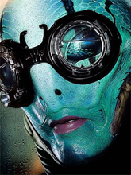 | 2 | Abe Sapien | - missing biography.placeOfBirth - missing work.base |
| 😰 | 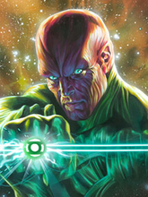 | 3 | Abin Sur | - missing biography.fullName |
| 😀 |  | 4 | Abomination |  |
| 😰 |  | 5 | Abraxas | - missing work.base |
| 😰 | 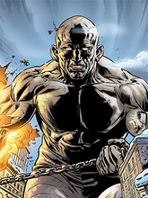 | 6 | Absorbing Man | - missing work.base |
| 😰 |  | 7 | Adam Monroe | - missing biography.fullName - missing biography.placeOfBirth - missing appearance.race - missing connections.groupAffiliation - missing connections.relatives |
| 😀 |  | 8 | Adam Strange |  |
| 😰 | 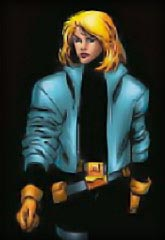 | 9 | Agent 13 | - missing powerstats.intelligence - missing powerstats.speed - missing powerstats.durability - missing powerstats.power - missing powerstats.combat - missing biography.placeOfBirth - missing appearance.race |
| 😰 | 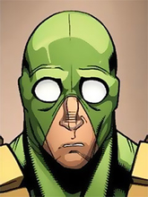 | 10 | Agent Bob | - missing biography.placeOfBirth |
| 😰 |  | 11 | Agent Zero | - missing biography.firstAppearance - missing appearance.race - missing appearance.eyeColor - missing appearance.hairColor - missing work.base |
| 😰 | 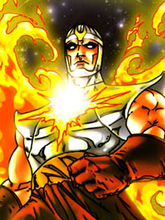 | 12 | Air-Walker | - missing appearance.race - missing work.base - missing connections.relatives |
| 😰 | 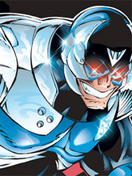 | 13 | Ajax | - missing biography.placeOfBirth - missing work.occupation - missing work.base - missing connections.relatives |
| 😰 |  | 14 | Alan Scott | - missing appearance.race - missing work.occupation |
| 😰 | 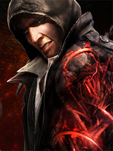 | 15 | Alex Mercer | - missing biography.placeOfBirth - missing biography.firstAppearance - missing appearance.eyeColor - missing appearance.hairColor - missing work.occupation - missing work.base |
| 😰 |  | 16 | Alex Woolsly | - missing powerstats.intelligence - missing powerstats.speed - missing powerstats.durability - missing powerstats.power - missing powerstats.combat - missing biography.placeOfBirth - missing appearance.race - missing appearance.eyeColor - missing appearance.hairColor - missing connections.groupAffiliation |
| 😰 |  | 17 | Alfred Pennyworth | - missing biography.placeOfBirth |
| 😰 | 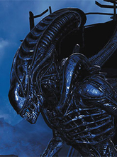 | 18 | Alien | - missing appearance.eyeColor - missing work.occupation - missing work.base - missing connections.groupAffiliation |
| 😰 |  | 19 | Allan Quatermain | - missing powerstats.intelligence - missing powerstats.strength - missing powerstats.speed - missing powerstats.durability - missing powerstats.power - missing powerstats.combat - missing biography.fullName - missing biography.placeOfBirth - missing appearance.race - missing appearance.eyeColor - missing appearance.hairColor - missing connections.relatives |
| 😰 | 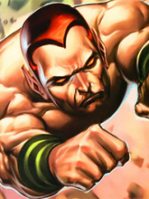 | 20 | Amazo | - missing biography.fullName - missing biography.placeOfBirth - missing appearance.hairColor - missing work.occupation - missing work.base |
| 😰 |  | 21 | Ammo | - missing powerstats.intelligence - missing powerstats.strength - missing powerstats.speed - missing powerstats.durability - missing powerstats.power - missing powerstats.combat - missing biography.fullName - missing biography.placeOfBirth - missing connections.relatives |
| 😰 |  | 22 | Ando Masahashi | - missing powerstats.intelligence - missing powerstats.strength - missing powerstats.speed - missing powerstats.durability - missing powerstats.power - missing powerstats.combat - missing biography.placeOfBirth - missing biography.firstAppearance - missing appearance.race - missing appearance.eyeColor - missing appearance.hairColor - missing work.base - missing connections.groupAffiliation - missing connections.relatives |
| 😰 | 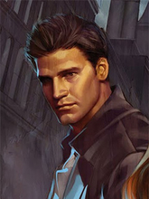 | 23 | Angel | - missing biography.placeOfBirth - missing biography.firstAppearance - missing appearance.eyeColor - missing appearance.hairColor - missing work.occupation - missing work.base - missing connections.groupAffiliation |
| 😰 | 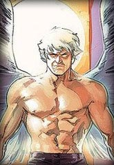 | 24 | Angel | - missing appearance.race - missing work.base |
| 😰 |  | 25 | Angel Dust | - missing biography.placeOfBirth - missing work.occupation - missing connections.groupAffiliation - missing connections.relatives |
| 😰 |  | 26 | Angel Salvadore | - missing biography.placeOfBirth - missing appearance.race - missing work.occupation - missing work.base |
| 😰 |  | 27 | Angela | - missing powerstats.intelligence - missing powerstats.speed - missing powerstats.durability - missing powerstats.power - missing powerstats.combat - missing biography.fullName - missing biography.placeOfBirth - missing biography.firstAppearance - missing appearance.race - missing appearance.eyeColor - missing appearance.hairColor - missing work.occupation - missing work.base - missing connections.groupAffiliation - missing connections.relatives |
| 😰 | 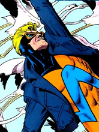 | 28 | Animal Man | - missing biography.placeOfBirth - missing work.occupation |
| 😰 |  | 29 | Annihilus | - missing appearance.race - missing work.base |
| 😰 | 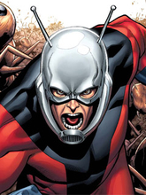 | 30 | Ant-Man | - missing connections.relatives |
| 😀 | 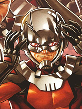 | 31 | Ant-Man II |  |
| 😰 |  | 32 | Anti-Monitor | - missing biography.fullName - missing work.occupation |
| 😰 |  | 33 | Anti-Spawn | - missing powerstats.intelligence - missing powerstats.speed - missing powerstats.durability - missing powerstats.power - missing powerstats.combat - missing biography.placeOfBirth - missing appearance.race - missing appearance.eyeColor - missing appearance.hairColor - missing work.occupation - missing work.base - missing connections.groupAffiliation - missing connections.relatives |
| 😰 | 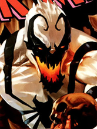 | 34 | Anti-Venom | - missing biography.alignment - missing connections.groupAffiliation |
| 😀 |  | 35 | Apocalypse |  |
| 😰 |  | 36 | Aquababy | - missing biography.placeOfBirth - missing appearance.race - missing work.occupation |
| 😀 |  | 37 | Aqualad |  |
| 😀 |  | 38 | Aquaman |  |
| 😀 |  | 39 | Arachne |  |
| 😰 | 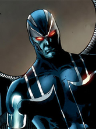 | 40 | Archangel | - missing work.base |
| 😰 |  | 41 | Arclight | - missing appearance.race - missing work.base - missing connections.relatives |
| 😰 | 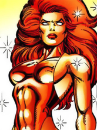 | 42 | Ardina | - missing biography.placeOfBirth - missing work.occupation - missing work.base - missing connections.groupAffiliation |
| 😰 |  | 43 | Ares | - missing biography.fullName - missing biography.placeOfBirth - missing appearance.race - missing work.occupation |
| 😰 |  | 44 | Ariel | - missing biography.placeOfBirth - missing appearance.race - missing work.base - missing connections.relatives |
| 😰 |  | 45 | Armor | - missing biography.placeOfBirth - missing appearance.race - missing work.base - missing connections.relatives |
| 😰 |  | 46 | Arsenal | - missing image - missing powerstats.intelligence - missing powerstats.speed - missing powerstats.durability - missing powerstats.power - missing powerstats.combat - missing biography.placeOfBirth - missing biography.firstAppearance - missing appearance.eyeColor - missing appearance.hairColor - missing work.occupation - missing work.base - missing connections.groupAffiliation - missing connections.relatives |
| 😰 |  | 47 | Astro Boy | - missing powerstats.intelligence - missing powerstats.speed - missing powerstats.durability - missing powerstats.power - missing powerstats.combat - missing biography.placeOfBirth - missing biography.firstAppearance - missing biography.publisher - missing appearance.race - missing work.occupation - missing work.base - missing connections.groupAffiliation - missing connections.relatives |
| 😰 |  | 48 | Atlas | - missing work.base |
| 😰 | 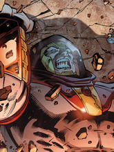 | 49 | Atlas | - missing biography.fullName - missing work.occupation - missing connections.groupAffiliation - missing connections.relatives |
| 😰 |  | 50 | Atom | - missing powerstats.intelligence - missing powerstats.strength - missing powerstats.speed - missing powerstats.durability - missing powerstats.power - missing powerstats.combat - missing biography.placeOfBirth - missing appearance.race |
| 😰 |  | 51 | Atom | - missing image - missing powerstats.intelligence - missing powerstats.strength - missing powerstats.speed - missing powerstats.durability - missing powerstats.power - missing powerstats.combat - missing biography.fullName - missing biography.placeOfBirth - missing biography.firstAppearance - missing appearance.race - missing appearance.eyeColor - missing appearance.hairColor - missing work.occupation - missing work.base - missing connections.groupAffiliation - missing connections.relatives |
| 😰 | 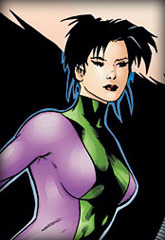 | 52 | Atom Girl | - missing biography.placeOfBirth - missing appearance.race - missing work.occupation - missing connections.relatives |
| 😰 |  | 53 | Atom II | - missing biography.placeOfBirth |
| 😰 |  | 54 | Atom III | - missing image - missing powerstats.intelligence - missing powerstats.strength - missing powerstats.speed - missing powerstats.durability - missing powerstats.power - missing powerstats.combat - missing biography.placeOfBirth - missing appearance.race - missing appearance.eyeColor - missing work.occupation - missing work.base |
| 😰 | 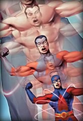 | 55 | Atom IV | - missing powerstats.intelligence - missing powerstats.strength - missing powerstats.speed - missing powerstats.durability - missing powerstats.power - missing powerstats.combat - missing biography.placeOfBirth - missing appearance.race |
| 😀 | 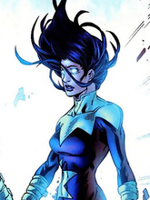 | 56 | Aurora |  |
| 😰 | 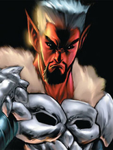 | 57 | Azazel | - missing biography.fullName - missing connections.groupAffiliation |
| 😰 |  | 58 | Azrael | - missing work.base |
| 😰 | 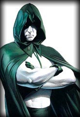 | 59 | Aztar | - missing powerstats.intelligence - missing powerstats.speed - missing powerstats.durability - missing powerstats.power - missing powerstats.combat - missing biography.placeOfBirth - missing appearance.race - missing appearance.eyeColor - missing appearance.hairColor - missing work.occupation - missing work.base - missing connections.relatives |
| 😰 |  | 60 | Bane | - missing biography.fullName - missing biography.placeOfBirth - missing appearance.eyeColor - missing appearance.hairColor - missing work.occupation |
| 😀 | 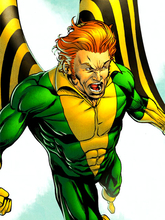 | 61 | Banshee |  |
| 😰 |  | 62 | Bantam | - missing biography.placeOfBirth - missing appearance.race - missing work.base - missing connections.relatives |
| 😰 |  | 63 | Batgirl | - missing biography.placeOfBirth - missing work.occupation - missing connections.groupAffiliation |
| 😰 | 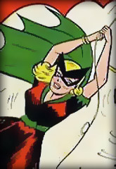 | 64 | Batgirl | - missing powerstats.intelligence - missing powerstats.speed - missing powerstats.durability - missing powerstats.power - missing powerstats.combat - missing biography.placeOfBirth - missing appearance.race - missing appearance.eyeColor - missing appearance.hairColor |
| 😰 |  | 65 | Batgirl III | - missing image - missing powerstats.intelligence - missing powerstats.speed - missing powerstats.durability - missing powerstats.power - missing powerstats.combat - missing biography.placeOfBirth - missing biography.firstAppearance - missing appearance.race - missing appearance.eyeColor - missing appearance.hairColor - missing work.occupation - missing work.base - missing connections.groupAffiliation - missing connections.relatives |
| 😰 | 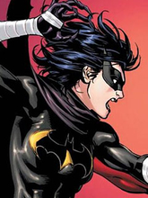 | 66 | Batgirl IV | - missing work.occupation |
| 😰 |  | 67 | Batgirl V | - missing image - missing powerstats.intelligence - missing powerstats.strength - missing powerstats.speed - missing powerstats.durability - missing powerstats.power - missing powerstats.combat - missing biography.placeOfBirth - missing biography.firstAppearance - missing appearance.race - missing appearance.eyeColor - missing appearance.hairColor - missing work.occupation - missing work.base - missing connections.groupAffiliation - missing connections.relatives |
| 😰 |  | 68 | Batgirl VI | - missing biography.placeOfBirth - missing appearance.race |
| 😰 | 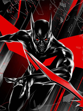 | 69 | Batman | - missing work.occupation |
| 😀 |  | 70 | Batman |  |
| 😰 |  | 71 | Batman II | - missing biography.placeOfBirth - missing biography.firstAppearance - missing work.occupation |
| 😰 |  | 72 | Battlestar | - missing appearance.race - missing work.base - missing connections.relatives |
| 😰 |  | 73 | Batwoman V | - missing biography.placeOfBirth - missing work.occupation |
| 😰 |  | 74 | Beak | - missing image - missing powerstats.intelligence - missing powerstats.strength - missing powerstats.speed - missing powerstats.durability - missing powerstats.power - missing powerstats.combat - missing biography.firstAppearance - missing appearance.race - missing work.occupation - missing work.base |
| 😀 |  | 75 | Beast |  |
| 😰 |  | 76 | Beast Boy | - missing biography.placeOfBirth |
| 😰 |  | 77 | Beetle | - missing image - missing powerstats.intelligence - missing powerstats.speed - missing powerstats.durability - missing powerstats.power - missing powerstats.combat - missing biography.fullName - missing biography.placeOfBirth - missing biography.firstAppearance - missing appearance.race - missing appearance.eyeColor - missing appearance.hairColor - missing work.occupation - missing work.base - missing connections.groupAffiliation - missing connections.relatives |
| 😰 |  | 78 | Ben 10 | - missing biography.placeOfBirth - missing appearance.race - missing appearance.eyeColor - missing appearance.hairColor - missing work.occupation - missing work.base - missing connections.groupAffiliation - missing connections.relatives |
| 😰 |  | 79 | Beta Ray Bill | - missing appearance.race - missing appearance.eyeColor - missing connections.relatives |
| 😰 |  | 80 | Beyonder | - missing biography.fullName - missing appearance.eyeColor - missing appearance.hairColor - missing work.base - missing connections.relatives |
| 😰 |  | 81 | Big Barda | - missing biography.placeOfBirth - missing work.occupation |
| 😰 | 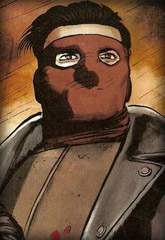 | 82 | Big Daddy | - missing biography.placeOfBirth - missing appearance.race - missing appearance.eyeColor - missing appearance.hairColor - missing work.occupation - missing work.base - missing connections.groupAffiliation |
| 😰 |  | 83 | Big Man | - missing biography.placeOfBirth - missing appearance.race - missing work.base |
| 😰 | 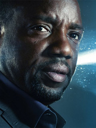 | 84 | Bill Harken | - missing biography.fullName - missing biography.placeOfBirth - missing biography.firstAppearance - missing appearance.eyeColor - missing appearance.hairColor - missing work.occupation - missing work.base - missing connections.relatives |
| 😰 |  | 85 | Billy Kincaid | - missing powerstats.intelligence - missing powerstats.strength - missing powerstats.speed - missing powerstats.durability - missing powerstats.power - missing powerstats.combat - missing biography.placeOfBirth - missing appearance.race - missing appearance.eyeColor - missing appearance.hairColor - missing work.occupation - missing work.base - missing connections.groupAffiliation - missing connections.relatives |
| 😰 |  | 86 | Binary | - missing powerstats.intelligence - missing powerstats.strength - missing powerstats.speed - missing powerstats.durability - missing powerstats.power - missing powerstats.combat - missing appearance.race |
| 😰 | 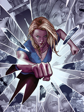 | 87 | Bionic Woman | - missing biography.placeOfBirth - missing biography.firstAppearance - missing biography.publisher - missing work.occupation - missing work.base - missing connections.groupAffiliation - missing connections.relatives |
| 😰 | 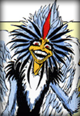 | 88 | Bird-Brain | - missing biography.fullName - missing biography.placeOfBirth - missing appearance.gender - missing appearance.race - missing appearance.eyeColor - missing appearance.hairColor - missing work.occupation - missing work.base - missing connections.relatives |
| 😰 | 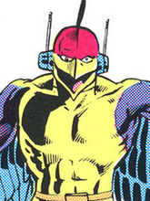 | 89 | Bird-Man | - missing powerstats.intelligence - missing powerstats.strength - missing powerstats.speed - missing powerstats.durability - missing powerstats.power - missing powerstats.combat - missing biography.placeOfBirth - missing appearance.eyeColor - missing appearance.hairColor - missing work.occupation - missing work.base - missing connections.relatives |
| 😰 | 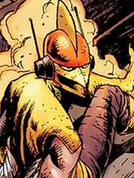 | 90 | Bird-Man II | - missing powerstats.intelligence - missing powerstats.strength - missing powerstats.speed - missing powerstats.durability - missing powerstats.power - missing powerstats.combat - missing appearance.eyeColor - missing appearance.hairColor - missing work.occupation - missing work.base - missing connections.relatives |
| 😰 | 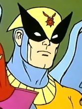 | 91 | Birdman | - missing powerstats.intelligence - missing powerstats.speed - missing powerstats.durability - missing powerstats.power - missing powerstats.combat - missing biography.placeOfBirth - missing appearance.eyeColor - missing appearance.hairColor - missing work.occupation - missing work.base - missing connections.groupAffiliation - missing connections.relatives |
| 😀 |  | 92 | Bishop |  |
| 😰 |  | 93 | Bizarro | - missing biography.placeOfBirth - missing work.occupation |
| 😰 |  | 94 | Black Abbott | - missing powerstats.intelligence - missing powerstats.strength - missing powerstats.speed - missing powerstats.durability - missing powerstats.power - missing powerstats.combat - missing biography.fullName - missing biography.placeOfBirth - missing appearance.race - missing work.base - missing connections.groupAffiliation - missing connections.relatives |
| 😰 |  | 95 | Black Adam | - missing appearance.race - missing work.occupation |
| 😀 | 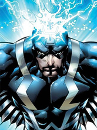 | 96 | Black Bolt |  |
| 😰 | 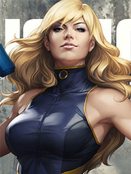 | 97 | Black Canary | - missing biography.placeOfBirth |
| 😰 |  | 98 | Black Canary | - missing biography.placeOfBirth |
| 😰 |  | 99 | Black Cat | - missing work.base |
| 😰 |  | 100 | Black Flash | - missing biography.fullName - missing biography.placeOfBirth - missing appearance.eyeColor - missing appearance.hairColor - missing work.occupation - missing work.base - missing connections.groupAffiliation - missing connections.relatives |
| 😰 |  | 101 | Black Goliath | - missing image - missing powerstats.intelligence - missing powerstats.strength - missing powerstats.speed - missing powerstats.durability - missing powerstats.power - missing powerstats.combat - missing biography.fullName - missing biography.placeOfBirth - missing biography.firstAppearance - missing appearance.race - missing appearance.eyeColor - missing appearance.hairColor - missing work.occupation - missing work.base - missing connections.groupAffiliation - missing connections.relatives |
| 😰 |  | 102 | Black Knight III | - missing work.base |
| 😰 | 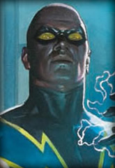 | 103 | Black Lightning | - missing biography.placeOfBirth - missing appearance.race |
| 😰 |  | 104 | Black Mamba | - missing appearance.race - missing connections.relatives |
| 😰 |  | 105 | Black Manta | - missing biography.placeOfBirth - missing work.occupation - missing work.base - missing connections.groupAffiliation - missing connections.relatives |
| 😀 | 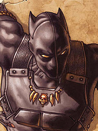 | 106 | Black Panther |  |
| 😰 | 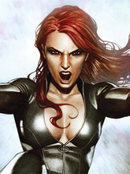 | 107 | Black Widow | - missing biography.placeOfBirth |
| 😰 | 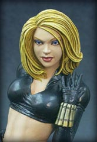 | 108 | Black Widow II | - missing powerstats.intelligence - missing powerstats.speed - missing powerstats.durability - missing powerstats.power - missing powerstats.combat - missing biography.placeOfBirth - missing biography.firstAppearance - missing appearance.race - missing work.occupation - missing work.base - missing connections.groupAffiliation - missing connections.relatives |
| 😰 | 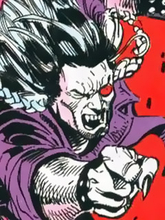 | 109 | Blackout | - missing biography.fullName - missing biography.placeOfBirth - missing work.base |
| 😰 | 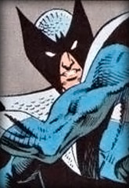 | 110 | Blackwing | - missing appearance.race - missing work.occupation - missing work.base |
| 😰 | 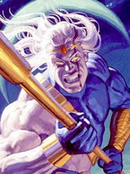 | 111 | Blackwulf | - missing biography.alignment - missing work.base |
| 😀 |  | 112 | Blade |  |
| 😰 |  | 113 | Blaquesmith | - missing image - missing powerstats.intelligence - missing powerstats.strength - missing powerstats.speed - missing powerstats.durability - missing powerstats.power - missing powerstats.combat - missing biography.fullName - missing biography.placeOfBirth - missing biography.firstAppearance - missing appearance.gender - missing appearance.race - missing connections.relatives |
| 😰 |  | 114 | Bling! | - missing biography.placeOfBirth - missing appearance.race - missing appearance.eyeColor - missing appearance.hairColor - missing work.occupation - missing connections.groupAffiliation |
| 😀 | 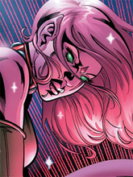 | 115 | Blink |  |
| 😰 |  | 116 | Blizzard | - missing powerstats.intelligence - missing powerstats.strength - missing powerstats.speed - missing powerstats.durability - missing powerstats.power - missing powerstats.combat - missing biography.placeOfBirth - missing appearance.race - missing appearance.eyeColor - missing connections.relatives |
| 😰 |  | 117 | Blizzard | - missing image - missing powerstats.intelligence - missing powerstats.speed - missing powerstats.durability - missing powerstats.power - missing powerstats.combat - missing biography.fullName - missing biography.placeOfBirth - missing biography.firstAppearance - missing appearance.race - missing appearance.eyeColor - missing appearance.hairColor - missing work.occupation - missing work.base - missing connections.groupAffiliation - missing connections.relatives |
| 😰 | 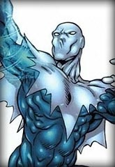 | 118 | Blizzard II | - missing appearance.race - missing work.base - missing connections.relatives |
| 😰 |  | 119 | Blob | - missing appearance.race - missing work.base - missing connections.relatives |
| 😰 |  | 120 | Bloodaxe | - missing biography.placeOfBirth - missing work.base - missing connections.groupAffiliation - missing connections.relatives |
| 😰 |  | 121 | Bloodhawk | - missing biography.placeOfBirth - missing work.occupation - missing work.base - missing connections.relatives |
| 😰 | 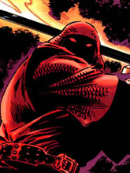 | 122 | Bloodwraith | - missing powerstats.intelligence - missing powerstats.speed - missing powerstats.durability - missing powerstats.power - missing powerstats.combat - missing biography.placeOfBirth - missing appearance.race - missing connections.groupAffiliation - missing connections.relatives |
| 😰 | 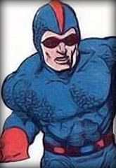 | 123 | Blue Beetle | - missing powerstats.intelligence - missing powerstats.strength - missing powerstats.speed - missing powerstats.durability - missing powerstats.power - missing powerstats.combat - missing biography.placeOfBirth - missing appearance.race - missing work.base - missing connections.groupAffiliation |
| 😰 |  | 124 | Blue Beetle | - missing image - missing powerstats.intelligence - missing powerstats.strength - missing powerstats.speed - missing powerstats.durability - missing powerstats.power - missing powerstats.combat - missing biography.fullName - missing biography.placeOfBirth - missing biography.firstAppearance - missing appearance.race - missing appearance.eyeColor - missing appearance.hairColor - missing work.occupation - missing work.base - missing connections.groupAffiliation - missing connections.relatives |
| 😰 |  | 125 | Blue Beetle II | - missing powerstats.intelligence - missing powerstats.speed - missing powerstats.durability - missing powerstats.power - missing powerstats.combat - missing appearance.race - missing work.base |
| 😀 | 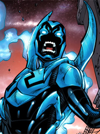 | 126 | Blue Beetle III |  |
| 😰 | 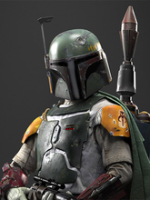 | 127 | Boba Fett | - missing biography.fullName - missing biography.firstAppearance - missing work.base - missing connections.groupAffiliation - missing connections.relatives |
| 😰 |  | 128 | Bolt | - missing image - missing powerstats.intelligence - missing powerstats.strength - missing powerstats.speed - missing powerstats.durability - missing powerstats.power - missing powerstats.combat - missing biography.fullName - missing biography.placeOfBirth - missing biography.firstAppearance - missing appearance.race - missing appearance.eyeColor - missing appearance.hairColor - missing work.occupation - missing work.base - missing connections.groupAffiliation - missing connections.relatives |
| 😰 |  | 129 | Bomb Queen | - missing powerstats.intelligence - missing powerstats.speed - missing powerstats.durability - missing powerstats.power - missing powerstats.combat - missing biography.fullName - missing biography.placeOfBirth - missing appearance.race - missing appearance.eyeColor - missing appearance.hairColor - missing work.occupation - missing work.base - missing connections.relatives |
| 😰 |  | 130 | Boom-Boom | - missing biography.placeOfBirth - missing work.base - missing connections.relatives |
| 😰 |  | 131 | Boomer | - missing image - missing powerstats.intelligence - missing powerstats.strength - missing powerstats.speed - missing powerstats.durability - missing powerstats.power - missing powerstats.combat - missing biography.fullName - missing biography.placeOfBirth - missing biography.firstAppearance - missing appearance.race - missing appearance.eyeColor - missing appearance.hairColor - missing work.occupation - missing work.base - missing connections.groupAffiliation - missing connections.relatives |
| 😰 |  | 133 | Box | - missing image - missing powerstats.intelligence - missing powerstats.strength - missing powerstats.speed - missing powerstats.durability - missing powerstats.power - missing powerstats.combat - missing biography.placeOfBirth - missing biography.firstAppearance - missing appearance.race - missing appearance.eyeColor - missing appearance.hairColor - missing work.occupation - missing work.base - missing connections.groupAffiliation - missing connections.relatives |
| 😰 |  | 134 | Box III | - missing image - missing powerstats.intelligence - missing powerstats.strength - missing powerstats.speed - missing powerstats.durability - missing powerstats.power - missing powerstats.combat - missing appearance.gender - missing appearance.race |
| 😰 |  | 135 | Box IV | - missing appearance.gender - missing appearance.race |
| 😰 |  | 136 | Brainiac | - missing biography.placeOfBirth - missing work.occupation - missing work.base |
| 😰 |  | 137 | Brainiac 5 | - missing biography.placeOfBirth - missing appearance.race - missing work.occupation - missing work.base |
| 😰 |  | 138 | Brother Voodoo | - missing powerstats.intelligence - missing powerstats.speed - missing powerstats.durability - missing powerstats.power - missing powerstats.combat - missing connections.groupAffiliation |
| 😰 |  | 139 | Brundlefly | - missing biography.placeOfBirth - missing biography.publisher - missing biography.alignment - missing appearance.eyeColor - missing appearance.hairColor - missing work.base - missing connections.groupAffiliation - missing connections.relatives |
| 😰 |  | 140 | Buffy | - missing biography.placeOfBirth - missing work.base |
| 😰 |  | 141 | Bullseye | - missing biography.placeOfBirth |
| 😰 |  | 142 | Bumblebee | - missing biography.placeOfBirth - missing work.occupation |
| 😰 |  | 143 | Bumbleboy | - missing image - missing powerstats.intelligence - missing powerstats.strength - missing powerstats.speed - missing powerstats.durability - missing powerstats.power - missing powerstats.combat - missing biography.fullName - missing biography.placeOfBirth - missing appearance.race - missing appearance.eyeColor - missing appearance.hairColor - missing work.occupation - missing work.base - missing connections.groupAffiliation - missing connections.relatives |
| 😰 |  | 144 | Bushido | - missing biography.placeOfBirth - missing appearance.eyeColor - missing appearance.hairColor - missing work.occupation - missing work.base - missing connections.relatives |
| 😀 |  | 145 | Cable |  |
| 😰 |  | 146 | Callisto | - missing biography.placeOfBirth - missing appearance.race - missing work.occupation - missing connections.relatives |
| 😰 |  | 147 | Cameron Hicks | - missing biography.fullName - missing biography.placeOfBirth - missing biography.firstAppearance - missing appearance.eyeColor - missing appearance.hairColor - missing work.occupation - missing work.base - missing connections.relatives |
| 😰 |  | 148 | Cannonball | - missing appearance.race - missing work.base |
| 😀 |  | 149 | Captain America |  |
| 😰 |  | 150 | Captain Atom | - missing biography.placeOfBirth - missing work.base |
| 😀 |  | 151 | Captain Britain |  |
| 😰 |  | 152 | Captain Cold | - missing biography.placeOfBirth - missing work.base |
| 😰 |  | 153 | Captain Epic | - missing powerstats.intelligence - missing powerstats.strength - missing powerstats.speed - missing powerstats.durability - missing powerstats.power - missing powerstats.combat - missing biography.fullName - missing appearance.race - missing connections.relatives |
| 😰 |  | 154 | Captain Hindsight | - missing biography.placeOfBirth - missing appearance.eyeColor - missing work.base - missing connections.groupAffiliation - missing connections.relatives |
| 😰 |  | 155 | Captain Mar-vell | - missing powerstats.intelligence - missing powerstats.speed - missing powerstats.durability - missing powerstats.power - missing powerstats.combat - missing appearance.race - missing work.base |
| 😰 |  | 156 | Captain Marvel | - missing work.occupation - missing work.base |
| 😀 |  | 157 | Captain Marvel |  |
| 😰 |  | 158 | Captain Marvel II | - missing biography.placeOfBirth |
| 😰 |  | 159 | Captain Midnight | - missing powerstats.intelligence - missing powerstats.strength - missing powerstats.speed - missing powerstats.durability - missing powerstats.power - missing powerstats.combat - missing biography.fullName - missing biography.placeOfBirth - missing biography.firstAppearance - missing appearance.eyeColor - missing appearance.hairColor - missing work.occupation - missing work.base - missing connections.groupAffiliation - missing connections.relatives |
| 😰 |  | 160 | Captain Planet | - missing biography.fullName - missing biography.placeOfBirth - missing work.occupation - missing work.base - missing connections.relatives |
| 😰 |  | 161 | Captain Universe | - missing powerstats.intelligence - missing powerstats.speed - missing powerstats.durability - missing powerstats.power - missing powerstats.combat - missing biography.fullName - missing biography.placeOfBirth - missing appearance.gender - missing appearance.eyeColor - missing appearance.hairColor - missing work.occupation - missing work.base - missing connections.groupAffiliation - missing connections.relatives |
| 😰 |  | 162 | Carnage | - missing biography.placeOfBirth - missing work.occupation |
| 😰 |  | 163 | Cat | - missing powerstats.intelligence - missing powerstats.speed - missing powerstats.durability - missing powerstats.power - missing powerstats.combat - missing appearance.race - missing connections.groupAffiliation - missing connections.relatives |
| 😰 |  | 164 | Cat II | - missing image - missing powerstats.intelligence - missing powerstats.strength - missing powerstats.speed - missing powerstats.durability - missing powerstats.power - missing powerstats.combat - missing biography.fullName - missing biography.placeOfBirth - missing biography.firstAppearance - missing appearance.race - missing appearance.eyeColor - missing appearance.hairColor - missing work.occupation - missing work.base - missing connections.groupAffiliation - missing connections.relatives |
| 😀 |  | 165 | Catwoman |  |
| 😰 |  | 166 | Cecilia Reyes | - missing powerstats.intelligence - missing powerstats.strength - missing powerstats.speed - missing powerstats.durability - missing powerstats.power - missing powerstats.combat - missing appearance.gender - missing appearance.race - missing connections.relatives |
| 😰 |  | 167 | Century | - missing biography.fullName - missing biography.placeOfBirth - missing work.base - missing connections.relatives |
| 😰 |  | 168 | Cerebra | - missing powerstats.intelligence - missing powerstats.speed - missing powerstats.durability - missing powerstats.power - missing powerstats.combat - missing biography.placeOfBirth - missing appearance.eyeColor - missing appearance.hairColor - missing work.occupation - missing work.base |
| 😰 |  | 169 | Chamber | - missing connections.relatives |
| 😰 |  | 170 | Chameleon | - missing appearance.race - missing appearance.eyeColor - missing appearance.hairColor - missing work.occupation - missing work.base |
| 😰 |  | 171 | Changeling | - missing biography.placeOfBirth - missing appearance.race - missing work.base - missing connections.relatives |
| 😰 |  | 172 | Cheetah | - missing biography.placeOfBirth - missing work.occupation - missing work.base |
| 😰 |  | 174 | Cheetah III | - missing biography.placeOfBirth - missing connections.relatives |
| 😰 |  | 175 | Chromos | - missing powerstats.intelligence - missing powerstats.strength - missing powerstats.speed - missing powerstats.durability - missing powerstats.power - missing powerstats.combat - missing appearance.race |
| 😰 |  | 176 | Chuck Norris | - missing biography.firstAppearance - missing biography.publisher - missing appearance.race - missing appearance.eyeColor - missing appearance.hairColor - missing work.occupation - missing work.base - missing connections.groupAffiliation - missing connections.relatives |
| 😰 |  | 177 | Citizen Steel | - missing biography.placeOfBirth |
| 😰 |  | 178 | Claire Bennet | - missing biography.placeOfBirth - missing appearance.race - missing connections.groupAffiliation |
| 😰 |  | 179 | Clea | - missing powerstats.intelligence - missing powerstats.speed - missing powerstats.durability - missing powerstats.power - missing powerstats.combat - missing biography.firstAppearance - missing appearance.gender - missing appearance.race - missing appearance.eyeColor - missing connections.groupAffiliation |
| 😰 |  | 180 | Cloak | - missing appearance.race |
| 😰 |  | 181 | Clock King | - missing biography.placeOfBirth - missing work.occupation - missing work.base |
| 😰 |  | 182 | Cogliostro | - missing powerstats.intelligence - missing powerstats.strength - missing powerstats.speed - missing powerstats.durability - missing powerstats.power - missing powerstats.combat - missing biography.placeOfBirth - missing appearance.race - missing appearance.eyeColor - missing appearance.hairColor - missing work.occupation - missing work.base - missing connections.groupAffiliation - missing connections.relatives |
| 😰 |  | 183 | Colin Wagner | - missing powerstats.intelligence - missing powerstats.strength - missing powerstats.speed - missing powerstats.durability - missing powerstats.power - missing powerstats.combat - missing biography.fullName - missing biography.placeOfBirth - missing biography.firstAppearance - missing appearance.race - missing work.occupation - missing work.base - missing connections.groupAffiliation - missing connections.relatives |
| 😰 |  | 184 | Colossal Boy | - missing image - missing powerstats.intelligence - missing powerstats.strength - missing powerstats.speed - missing powerstats.durability - missing powerstats.power - missing powerstats.combat - missing biography.fullName - missing biography.placeOfBirth - missing biography.firstAppearance - missing appearance.race - missing appearance.eyeColor - missing appearance.hairColor - missing work.occupation - missing work.base - missing connections.groupAffiliation - missing connections.relatives |
| 😀 |  | 185 | Colossus |  |
| 😰 |  | 186 | Copycat | - missing biography.placeOfBirth - missing work.occupation |
| 😰 |  | 187 | Corsair | - missing powerstats.intelligence - missing powerstats.speed - missing powerstats.durability - missing powerstats.power - missing powerstats.combat - missing biography.placeOfBirth - missing appearance.race |
| 😰 |  | 188 | Cottonmouth | - missing biography.placeOfBirth - missing connections.relatives |
| 😰 |  | 189 | Crimson Crusader | - missing powerstats.intelligence - missing powerstats.speed - missing powerstats.durability - missing powerstats.power - missing powerstats.combat - missing appearance.race - missing work.occupation - missing work.base |
| 😰 |  | 190 | Crimson Dynamo | - missing powerstats.intelligence - missing powerstats.speed - missing powerstats.durability - missing powerstats.power - missing powerstats.combat - missing biography.placeOfBirth - missing appearance.race - missing connections.groupAffiliation - missing connections.relatives |
| 😰 |  | 191 | Crystal | - missing work.base |
| 😰 |  | 192 | Curse | - missing powerstats.intelligence - missing powerstats.strength - missing powerstats.speed - missing powerstats.durability - missing powerstats.power - missing powerstats.combat - missing biography.placeOfBirth - missing appearance.race - missing appearance.eyeColor - missing appearance.hairColor - missing work.occupation - missing work.base - missing connections.groupAffiliation - missing connections.relatives |
| 😰 |  | 193 | Cy-Gor | - missing powerstats.intelligence - missing powerstats.speed - missing powerstats.durability - missing powerstats.power - missing powerstats.combat - missing biography.fullName - missing biography.placeOfBirth - missing biography.firstAppearance - missing appearance.race - missing appearance.eyeColor - missing appearance.hairColor - missing work.occupation - missing work.base - missing connections.groupAffiliation - missing connections.relatives |
| 😀 |  | 194 | Cyborg |  |
| 😰 |  | 195 | Cyborg Superman | - missing biography.placeOfBirth - missing work.occupation |
| 😀 |  | 196 | Cyclops |  |
| 😰 |  | 197 | Cypher | - missing powerstats.intelligence - missing powerstats.speed - missing powerstats.durability - missing powerstats.power - missing powerstats.combat - missing appearance.gender - missing appearance.race |
| 😰 |  | 198 | Dagger | - missing appearance.race |
| 😰 |  | 199 | Danny Cooper | - missing powerstats.intelligence - missing powerstats.strength - missing powerstats.speed - missing powerstats.durability - missing powerstats.power - missing powerstats.combat - missing biography.fullName - missing biography.placeOfBirth - missing biography.firstAppearance - missing appearance.race - missing work.occupation - missing work.base - missing connections.groupAffiliation - missing connections.relatives |
| 😰 |  | 200 | Daphne Powell | - missing biography.placeOfBirth - missing appearance.race - missing appearance.eyeColor - missing appearance.hairColor - missing work.base - missing connections.groupAffiliation |
| 😀 |  | 201 | Daredevil |  |
| 😀 |  | 202 | Darkhawk |  |
| 😰 |  | 203 | Darkman | - missing biography.placeOfBirth - missing appearance.race - missing appearance.eyeColor - missing appearance.hairColor - missing work.base - missing connections.groupAffiliation |
| 😰 |  | 204 | Darkseid | - missing biography.placeOfBirth - missing work.base |
| 😰 |  | 205 | Darkside | - missing image - missing powerstats.intelligence - missing powerstats.strength - missing powerstats.speed - missing powerstats.durability - missing powerstats.power - missing powerstats.combat - missing biography.fullName - missing biography.placeOfBirth - missing biography.firstAppearance - missing biography.publisher - missing appearance.gender - missing appearance.race - missing appearance.eyeColor - missing appearance.hairColor - missing work.occupation - missing work.base - missing connections.groupAffiliation - missing connections.relatives |
| 😀 |  | 206 | Darkstar |  |
| 😰 |  | 207 | Darth Maul | - missing biography.fullName - missing appearance.hairColor - missing work.occupation - missing work.base - missing connections.groupAffiliation |
| 😀 |  | 208 | Darth Vader |  |
| 😰 |  | 209 | Dash | - missing biography.placeOfBirth - missing work.occupation - missing work.base |
| 😰 |  | 210 | Data | - missing biography.placeOfBirth - missing biography.firstAppearance - missing work.base - missing connections.groupAffiliation |
| 😰 |  | 211 | Dazzler | - missing work.base |
| 😰 |  | 212 | Deadman | - missing biography.placeOfBirth |
| 😀 |  | 213 | Deadpool |  |
| 😰 |  | 214 | Deadshot | - missing biography.placeOfBirth - missing work.occupation - missing work.base - missing connections.groupAffiliation - missing connections.relatives |
| 😰 |  | 215 | Deathlok | - missing biography.placeOfBirth - missing work.occupation |
| 😰 |  | 216 | Deathstroke | - missing biography.placeOfBirth |
| 😰 |  | 217 | Demogoblin | - missing biography.fullName - missing biography.placeOfBirth - missing connections.groupAffiliation - missing connections.relatives |
| 😰 |  | 218 | Destroyer | - missing biography.fullName - missing appearance.race - missing appearance.eyeColor - missing appearance.hairColor - missing work.occupation - missing work.base - missing connections.groupAffiliation - missing connections.relatives |
| 😰 |  | 219 | Diamondback | - missing biography.placeOfBirth - missing work.base - missing connections.relatives |
| 😰 |  | 220 | DL Hawkins | - missing biography.placeOfBirth - missing appearance.race - missing appearance.eyeColor - missing appearance.hairColor - missing connections.groupAffiliation |
| 😰 |  | 221 | Doc Samson | - missing connections.groupAffiliation |
| 😀 |  | 222 | Doctor Doom |  |
| 😰 |  | 223 | Doctor Doom II | - missing powerstats.intelligence - missing powerstats.strength - missing powerstats.speed - missing powerstats.durability - missing powerstats.power - missing powerstats.combat - missing appearance.race - missing work.occupation - missing connections.groupAffiliation |
| 😰 |  | 224 | Doctor Fate | - missing biography.placeOfBirth - missing work.occupation |
| 😰 |  | 225 | Doctor Octopus | - missing connections.relatives |
| 😰 |  | 226 | Doctor Strange | - missing work.base |
| 😰 |  | 227 | Domino | - missing work.occupation - missing work.base |
| 😰 |  | 228 | Donatello | - missing biography.fullName - missing biography.placeOfBirth - missing work.occupation - missing work.base - missing connections.groupAffiliation |
| 😰 |  | 229 | Donna Troy | - missing powerstats.intelligence - missing powerstats.speed - missing powerstats.durability - missing powerstats.power - missing powerstats.combat - missing biography.placeOfBirth - missing work.occupation - missing work.base - missing connections.relatives |
| 😰 |  | 230 | Doomsday | - missing work.base - missing connections.relatives |
| 😰 |  | 231 | Doppelganger | - missing biography.fullName - missing appearance.race - missing work.occupation - missing work.base |
| 😰 |  | 232 | Dormammu | - missing appearance.race - missing work.base |
| 😰 |  | 233 | Dr Manhattan | - missing biography.placeOfBirth - missing connections.relatives |
| 😰 |  | 234 | Drax the Destroyer | - missing work.occupation |
| 😰 |  | 235 | Ego | - missing appearance.gender - missing appearance.race - missing appearance.eyeColor - missing appearance.hairColor - missing connections.groupAffiliation |
| 😰 |  | 236 | Elastigirl | - missing biography.placeOfBirth - missing work.occupation - missing work.base |
| 😰 |  | 237 | Electro | - missing biography.placeOfBirth - missing work.base |
| 😰 |  | 238 | Elektra | - missing biography.placeOfBirth - missing work.base |
| 😰 |  | 239 | Elle Bishop | - missing biography.fullName - missing biography.placeOfBirth - missing appearance.race - missing work.base - missing connections.groupAffiliation |
| 😰 |  | 240 | Elongated Man | - missing biography.placeOfBirth - missing appearance.race |
| 😰 |  | 241 | Emma Frost | - missing appearance.race - missing work.occupation |
| 😰 |  | 242 | Enchantress | - missing biography.placeOfBirth - missing work.base - missing connections.relatives |
| 😰 |  | 243 | Energy | - missing powerstats.intelligence - missing powerstats.strength - missing powerstats.speed - missing powerstats.durability - missing powerstats.power - missing powerstats.combat - missing biography.fullName - missing biography.placeOfBirth - missing biography.firstAppearance - missing appearance.race - missing appearance.eyeColor - missing appearance.hairColor - missing work.occupation - missing work.base - missing connections.groupAffiliation - missing connections.relatives |
| 😰 |  | 244 | ERG-1 | - missing image - missing powerstats.intelligence - missing powerstats.strength - missing powerstats.speed - missing powerstats.durability - missing powerstats.power - missing powerstats.combat - missing biography.fullName - missing biography.placeOfBirth - missing biography.firstAppearance - missing appearance.race - missing appearance.eyeColor - missing appearance.hairColor - missing work.occupation - missing work.base - missing connections.groupAffiliation - missing connections.relatives |
| 😰 |  | 245 | Ethan Hunt | - missing biography.firstAppearance - missing biography.publisher - missing work.base |
| 😰 |  | 246 | Etrigan | - missing work.occupation |
| 😰 |  | 247 | Evil Deadpool | - missing biography.placeOfBirth - missing work.base - missing connections.relatives |
| 😰 |  | 248 | Evilhawk | - missing biography.placeOfBirth - missing connections.groupAffiliation - missing connections.relatives |
| 😰 |  | 249 | Exodus | - missing biography.placeOfBirth - missing connections.relatives |
| 😰 |  | 250 | Fabian Cortez | - missing powerstats.intelligence - missing powerstats.strength - missing powerstats.speed - missing powerstats.durability - missing powerstats.power - missing powerstats.combat - missing appearance.gender - missing appearance.race |
| 😀 |  | 251 | Falcon |  |
| 😰 |  | 252 | Fallen One II | - missing biography.fullName - missing biography.placeOfBirth - missing biography.firstAppearance - missing appearance.race - missing work.occupation - missing work.base - missing connections.relatives |
| 😰 |  | 253 | Faora | - missing biography.placeOfBirth - missing appearance.eyeColor - missing appearance.hairColor |
| 😰 |  | 254 | Feral | - missing appearance.gender - missing appearance.race |
| 😰 |  | 255 | Fighting Spirit | - missing powerstats.intelligence - missing powerstats.strength - missing powerstats.speed - missing powerstats.durability - missing powerstats.power - missing powerstats.combat - missing biography.placeOfBirth - missing biography.firstAppearance - missing appearance.race - missing appearance.eyeColor - missing work.occupation |
| 😰 |  | 256 | Fin Fang Foom | - missing biography.fullName - missing biography.placeOfBirth - missing biography.firstAppearance - missing work.occupation |
| 😰 |  | 257 | Firebird | - missing appearance.race - missing connections.relatives |
| 😰 |  | 258 | Firelord | - missing appearance.gender - missing appearance.race - missing connections.relatives |
| 😀 |  | 259 | Firestar |  |
| 😰 |  | 260 | Firestorm | - missing biography.placeOfBirth - missing appearance.race |
| 😰 |  | 261 | Firestorm | - missing biography.placeOfBirth |
| 😰 |  | 262 | Fixer | - missing powerstats.intelligence - missing powerstats.strength - missing powerstats.speed - missing powerstats.durability - missing powerstats.power - missing powerstats.combat - missing appearance.gender - missing appearance.race |
| 😀 |  | 263 | Flash |  |
| 😰 |  | 264 | Flash Gordon | - missing powerstats.intelligence - missing powerstats.speed - missing powerstats.durability - missing powerstats.power - missing powerstats.combat - missing biography.placeOfBirth - missing biography.publisher - missing appearance.race - missing appearance.eyeColor - missing appearance.hairColor - missing work.occupation - missing work.base - missing connections.groupAffiliation - missing connections.relatives |
| 😀 |  | 265 | Flash II |  |
| 😰 |  | 266 | Flash III | - missing appearance.eyeColor - missing appearance.hairColor |
| 😰 |  | 267 | Flash IV | - missing biography.placeOfBirth |
| 😰 |  | 268 | Forge | - missing biography.fullName - missing appearance.gender - missing appearance.race - missing connections.relatives |
| 😀 |  | 269 | Franklin Richards |  |
| 😰 |  | 270 | Franklin Storm | - missing appearance.gender - missing appearance.race - missing connections.groupAffiliation |
| 😰 |  | 271 | Frenzy | - missing biography.placeOfBirth - missing appearance.race - missing connections.relatives |
| 😰 |  | 272 | Frigga | - missing powerstats.intelligence - missing powerstats.strength - missing powerstats.speed - missing powerstats.durability - missing powerstats.power - missing powerstats.combat - missing appearance.race |
| 😀 |  | 273 | Galactus |  |
| 😀 |  | 274 | Gambit |  |
| 😀 |  | 275 | Gamora |  |
| 😰 |  | 276 | Garbage Man | - missing powerstats.intelligence - missing powerstats.speed - missing powerstats.durability - missing powerstats.power - missing powerstats.combat - missing biography.placeOfBirth - missing appearance.eyeColor - missing appearance.hairColor - missing work.occupation - missing work.base - missing connections.groupAffiliation - missing connections.relatives |
| 😰 |  | 277 | Gary Bell | - missing biography.placeOfBirth - missing biography.firstAppearance - missing appearance.eyeColor - missing appearance.hairColor - missing work.occupation - missing work.base - missing connections.relatives |
| 😰 |  | 278 | General Zod | - missing work.occupation |
| 😰 |  | 279 | Genesis | - missing powerstats.intelligence - missing powerstats.speed - missing powerstats.durability - missing powerstats.power - missing powerstats.combat - missing biography.placeOfBirth - missing appearance.race - missing work.base |
| 😀 |  | 280 | Ghost Rider |  |
| 😰 |  | 281 | Ghost Rider II | - missing powerstats.intelligence - missing powerstats.speed - missing powerstats.durability - missing powerstats.power - missing powerstats.combat - missing biography.placeOfBirth - missing appearance.gender - missing appearance.race - missing appearance.eyeColor - missing appearance.hairColor - missing work.occupation - missing work.base |
| 😰 |  | 282 | Giant-Man | - missing image - missing powerstats.intelligence - missing powerstats.speed - missing powerstats.durability - missing powerstats.power - missing powerstats.combat - missing biography.placeOfBirth - missing biography.firstAppearance - missing appearance.eyeColor - missing appearance.hairColor - missing work.occupation - missing work.base - missing connections.groupAffiliation - missing connections.relatives |
| 😰 |  | 283 | Giant-Man II | - missing image - missing powerstats.intelligence - missing powerstats.strength - missing powerstats.speed - missing powerstats.durability - missing powerstats.power - missing powerstats.combat - missing biography.fullName - missing biography.placeOfBirth - missing biography.firstAppearance - missing appearance.race - missing appearance.eyeColor - missing appearance.hairColor - missing work.occupation - missing work.base - missing connections.groupAffiliation - missing connections.relatives |
| 😰 |  | 284 | Giganta | - missing biography.placeOfBirth - missing appearance.race - missing connections.relatives |
| 😰 |  | 285 | Gladiator | - missing biography.placeOfBirth |
| 😰 |  | 286 | Goblin Queen | - missing appearance.race - missing work.occupation |
| 😰 |  | 287 | Godzilla | - missing biography.placeOfBirth - missing biography.publisher - missing appearance.gender - missing appearance.eyeColor - missing appearance.hairColor - missing work.occupation - missing work.base - missing connections.groupAffiliation - missing connections.relatives |
| 😰 |  | 288 | Gog | - missing image - missing biography.fullName - missing biography.placeOfBirth - missing appearance.race - missing appearance.eyeColor - missing appearance.hairColor - missing work.occupation - missing work.base |
| 😰 |  | 289 | Goku | - missing biography.placeOfBirth - missing appearance.eyeColor - missing appearance.hairColor - missing work.occupation - missing work.base - missing connections.relatives |
| 😰 |  | 290 | Goliath | - missing image - missing powerstats.intelligence - missing powerstats.strength - missing powerstats.speed - missing powerstats.durability - missing powerstats.power - missing powerstats.combat - missing biography.placeOfBirth - missing biography.firstAppearance - missing appearance.race - missing appearance.eyeColor - missing appearance.hairColor - missing work.occupation - missing work.base - missing connections.groupAffiliation - missing connections.relatives |
| 😰 |  | 291 | Goliath | - missing image - missing powerstats.intelligence - missing powerstats.strength - missing powerstats.speed - missing powerstats.durability - missing powerstats.power - missing powerstats.combat - missing biography.placeOfBirth - missing biography.firstAppearance - missing appearance.eyeColor - missing appearance.hairColor - missing work.occupation - missing work.base - missing connections.groupAffiliation - missing connections.relatives |
| 😰 |  | 292 | Goliath | - missing image - missing powerstats.intelligence - missing powerstats.strength - missing powerstats.speed - missing powerstats.durability - missing powerstats.power - missing powerstats.combat - missing biography.placeOfBirth - missing biography.firstAppearance - missing appearance.eyeColor - missing appearance.hairColor - missing work.occupation - missing work.base - missing connections.groupAffiliation - missing connections.relatives |
| 😰 |  | 293 | Goliath IV | - missing powerstats.intelligence - missing powerstats.strength - missing powerstats.speed - missing powerstats.durability - missing powerstats.power - missing powerstats.combat - missing appearance.race - missing work.base |
| 😰 |  | 294 | Gorilla Grodd | - missing biography.placeOfBirth - missing work.occupation - missing connections.groupAffiliation |
| 😰 |  | 295 | Granny Goodness | - missing powerstats.intelligence - missing powerstats.speed - missing powerstats.durability - missing powerstats.power - missing powerstats.combat - missing biography.fullName - missing biography.firstAppearance - missing appearance.race - missing work.occupation - missing work.base - missing connections.relatives |
| 😀 |  | 296 | Gravity |  |
| 😰 |  | 297 | Greedo | - missing biography.firstAppearance - missing appearance.hairColor - missing work.base - missing connections.groupAffiliation - missing connections.relatives |
| 😰 |  | 298 | Green Arrow | - missing biography.placeOfBirth |
| 😀 |  | 299 | Green Goblin |  |
| 😰 |  | 300 | Green Goblin II | - missing appearance.race - missing work.occupation - missing connections.groupAffiliation |
| 😰 |  | 301 | Green Goblin III | - missing powerstats.intelligence - missing powerstats.strength - missing powerstats.speed - missing powerstats.durability - missing powerstats.power - missing powerstats.combat - missing biography.placeOfBirth - missing appearance.race - missing appearance.eyeColor - missing appearance.hairColor - missing work.base - missing connections.groupAffiliation - missing connections.relatives |
| 😰 |  | 302 | Green Goblin IV | - missing powerstats.intelligence - missing powerstats.strength - missing powerstats.speed - missing powerstats.durability - missing powerstats.power - missing powerstats.combat - missing biography.placeOfBirth - missing appearance.race - missing work.base - missing connections.groupAffiliation |
| 😰 |  | 303 | Groot | - missing biography.placeOfBirth - missing appearance.hairColor - missing work.occupation - missing connections.relatives |
| 😰 |  | 304 | Guardian | - missing powerstats.intelligence - missing powerstats.speed - missing powerstats.durability - missing powerstats.power - missing powerstats.combat |
| 😰 |  | 305 | Guy Gardner | - missing connections.relatives |
| 😰 |  | 306 | Hal Jordan | - missing work.base |
| 😰 |  | 307 | Han Solo | - missing work.occupation - missing work.base - missing connections.groupAffiliation - missing connections.relatives |
| 😰 |  | 308 | Hancock | - missing biography.placeOfBirth - missing biography.firstAppearance - missing work.occupation - missing work.base - missing connections.groupAffiliation - missing connections.relatives |
| 😰 |  | 309 | Harley Quinn | - missing biography.placeOfBirth |
| 😰 |  | 310 | Harry Potter | - missing biography.placeOfBirth - missing work.base - missing connections.groupAffiliation - missing connections.relatives |
| 😀 |  | 311 | Havok |  |
| 😰 |  | 312 | Hawk | - missing biography.placeOfBirth - missing appearance.race - missing work.occupation - missing work.base |
| 😰 |  | 313 | Hawkeye | - missing work.base |
| 😀 |  | 314 | Hawkeye II |  |
| 😰 |  | 315 | Hawkgirl | - missing biography.placeOfBirth - missing appearance.race |
| 😰 |  | 316 | Hawkman | - missing powerstats.intelligence - missing powerstats.speed - missing powerstats.durability - missing powerstats.power - missing powerstats.combat - missing biography.placeOfBirth - missing appearance.race - missing work.base |
| 😰 |  | 317 | Hawkwoman | - missing powerstats.intelligence - missing powerstats.speed - missing powerstats.durability - missing powerstats.power - missing powerstats.combat - missing biography.placeOfBirth - missing appearance.race - missing work.occupation - missing connections.relatives |
| 😰 |  | 318 | Hawkwoman II | - missing powerstats.intelligence - missing powerstats.strength - missing powerstats.speed - missing powerstats.durability - missing powerstats.power - missing powerstats.combat - missing biography.placeOfBirth - missing biography.firstAppearance - missing appearance.race - missing appearance.eyeColor - missing appearance.hairColor - missing work.occupation - missing work.base - missing connections.groupAffiliation - missing connections.relatives |
| 😰 |  | 319 | Hawkwoman III | - missing powerstats.intelligence - missing powerstats.speed - missing powerstats.durability - missing powerstats.power - missing powerstats.combat - missing biography.placeOfBirth - missing biography.firstAppearance - missing appearance.race - missing connections.groupAffiliation - missing connections.relatives |
| 😰 |  | 320 | Heat Wave | - missing biography.placeOfBirth - missing connections.relatives |
| 😰 |  | 321 | Hela | - missing biography.fullName - missing biography.placeOfBirth - missing work.base - missing connections.groupAffiliation |
| 😰 |  | 322 | Hellboy | - missing biography.placeOfBirth - missing work.occupation - missing work.base |
| 😀 |  | 323 | Hellcat |  |
| 😰 |  | 324 | Hellstorm | - missing powerstats.intelligence - missing powerstats.speed - missing powerstats.durability - missing powerstats.power - missing powerstats.combat - missing appearance.race |
| 😰 |  | 325 | Hercules | - missing biography.firstAppearance - missing connections.relatives |
| 😰 |  | 326 | Hiro Nakamura | - missing powerstats.intelligence - missing powerstats.speed - missing powerstats.durability - missing powerstats.power - missing powerstats.combat - missing biography.firstAppearance - missing appearance.race - missing appearance.eyeColor - missing appearance.hairColor - missing work.base - missing connections.groupAffiliation |
| 😰 |  | 327 | Hit-Girl | - missing biography.placeOfBirth - missing biography.firstAppearance - missing appearance.eyeColor - missing appearance.hairColor - missing work.occupation - missing work.base - missing connections.groupAffiliation - missing connections.relatives |
| 😰 |  | 328 | Hobgoblin | - missing powerstats.intelligence - missing powerstats.speed - missing powerstats.durability - missing powerstats.power - missing powerstats.combat - missing biography.placeOfBirth - missing biography.firstAppearance - missing appearance.race - missing work.base - missing connections.groupAffiliation |
| 😰 |  | 329 | Hollow | - missing powerstats.intelligence - missing powerstats.strength - missing powerstats.speed - missing powerstats.durability - missing powerstats.power - missing powerstats.combat - missing biography.placeOfBirth - missing appearance.race - missing work.occupation |
| 😰 |  | 330 | Hope Summers | - missing biography.placeOfBirth - missing appearance.race - missing work.occupation - missing work.base |
| 😰 |  | 331 | Howard the Duck | - missing image - missing powerstats.intelligence - missing powerstats.speed - missing powerstats.durability - missing powerstats.power - missing powerstats.combat - missing appearance.race |
| 😀 |  | 332 | Hulk |  |
| 😀 |  | 333 | Human Torch |  |
| 😰 |  | 334 | Huntress | - missing biography.placeOfBirth - missing appearance.race |
| 😀 |  | 335 | Husk |  |
| 😰 |  | 336 | Hybrid | - missing work.occupation |
| 😰 |  | 337 | Hydro-Man | - missing appearance.race - missing work.base - missing connections.relatives |
| 😰 |  | 338 | Hyperion | - missing biography.placeOfBirth - missing work.base |
| 😰 |  | 339 | Iceman | - missing work.base |
| 😰 |  | 340 | Impulse | - missing biography.placeOfBirth |
| 😰 |  | 341 | Indiana Jones | - missing appearance.eyeColor - missing appearance.hairColor - missing work.base - missing connections.groupAffiliation - missing connections.relatives |
| 😰 |  | 342 | Indigo | - missing biography.placeOfBirth - missing appearance.eyeColor - missing work.base - missing connections.relatives |
| 😰 |  | 343 | Ink | - missing biography.placeOfBirth - missing work.occupation - missing work.base - missing connections.relatives |
| 😀 |  | 344 | Invisible Woman |  |
| 😰 |  | 345 | Iron Fist | - missing biography.placeOfBirth |
| 😀 |  | 346 | Iron Man |  |
| 😰 |  | 347 | Iron Monger | - missing biography.placeOfBirth - missing biography.firstAppearance - missing appearance.race - missing work.base |
| 😰 |  | 348 | Isis | - missing biography.placeOfBirth - missing appearance.race - missing appearance.eyeColor - missing appearance.hairColor |
| 😰 |  | 349 | Jack Bauer | - missing powerstats.intelligence - missing powerstats.speed - missing powerstats.durability - missing powerstats.power - missing powerstats.combat - missing biography.publisher - missing appearance.race - missing appearance.eyeColor - missing appearance.hairColor - missing work.occupation - missing work.base - missing connections.groupAffiliation - missing connections.relatives |
| 😀 |  | 350 | Jack of Hearts |  |
| 😰 |  | 351 | Jack-Jack | - missing biography.placeOfBirth - missing work.occupation - missing work.base |
| 😰 |  | 352 | James Bond | - missing biography.placeOfBirth |
| 😰 |  | 353 | James T. Kirk | - missing work.base |
| 😰 |  | 354 | Jar Jar Binks | - missing biography.firstAppearance - missing appearance.hairColor - missing work.occupation - missing work.base - missing connections.groupAffiliation - missing connections.relatives |
| 😰 |  | 355 | Jason Bourne | - missing biography.placeOfBirth - missing biography.firstAppearance - missing biography.publisher - missing appearance.eyeColor - missing appearance.hairColor - missing work.occupation - missing work.base - missing connections.groupAffiliation - missing connections.relatives |
| 😰 |  | 356 | Jean Grey | - missing biography.placeOfBirth |
| 😰 |  | 357 | Jean-Luc Picard | - missing appearance.eyeColor - missing appearance.hairColor - missing work.base - missing connections.groupAffiliation |
| 😰 |  | 358 | Jennifer Kale | - missing appearance.race - missing work.base |
| 😰 |  | 359 | Jesse Quick | - missing powerstats.intelligence - missing powerstats.speed - missing powerstats.durability - missing powerstats.power - missing powerstats.combat - missing biography.placeOfBirth - missing biography.firstAppearance - missing appearance.eyeColor - missing appearance.hairColor - missing work.occupation - missing work.base - missing connections.groupAffiliation - missing connections.relatives |
| 😰 |  | 360 | Jessica Cruz | - missing biography.placeOfBirth - missing work.occupation - missing work.base - missing connections.groupAffiliation |
| 😰 |  | 361 | Jessica Jones | - missing work.base |
| 😰 |  | 362 | Jessica Sanders | - missing image - missing powerstats.intelligence - missing powerstats.strength - missing powerstats.speed - missing powerstats.durability - missing powerstats.power - missing powerstats.combat - missing biography.fullName - missing biography.placeOfBirth - missing biography.firstAppearance - missing appearance.race - missing appearance.eyeColor - missing appearance.hairColor - missing work.occupation - missing work.base - missing connections.groupAffiliation - missing connections.relatives |
| 😰 |  | 363 | Jigsaw | - missing powerstats.intelligence - missing powerstats.strength - missing powerstats.speed - missing powerstats.durability - missing powerstats.power - missing powerstats.combat - missing biography.placeOfBirth - missing appearance.race - missing connections.relatives |
| 😰 |  | 364 | Jim Powell | - missing biography.placeOfBirth - missing appearance.race - missing appearance.eyeColor - missing appearance.hairColor - missing work.base - missing connections.groupAffiliation |
| 😰 |  | 365 | JJ Powell | - missing biography.placeOfBirth - missing appearance.race - missing appearance.eyeColor - missing appearance.hairColor - missing work.base - missing connections.groupAffiliation |
| 😰 |  | 366 | Johann Krauss | - missing powerstats.intelligence - missing powerstats.speed - missing powerstats.durability - missing powerstats.power - missing powerstats.combat - missing biography.placeOfBirth - missing appearance.race - missing appearance.eyeColor - missing appearance.hairColor - missing work.occupation - missing work.base - missing connections.relatives |
| 😰 |  | 367 | John Constantine | - missing biography.placeOfBirth - missing work.occupation - missing work.base |
| 😰 |  | 369 | John Wraith | - missing image - missing biography.placeOfBirth - missing appearance.race - missing work.base - missing connections.relatives |
| 😰 |  | 370 | Joker | - missing biography.placeOfBirth - missing work.occupation |
| 😰 |  | 371 | Jolt | - missing appearance.race - missing work.base |
| 😀 |  | 372 | Jubilee |  |
| 😰 |  | 373 | Judge Dredd | - missing appearance.eyeColor - missing appearance.hairColor - missing connections.groupAffiliation |
| 😰 |  | 374 | Juggernaut | - missing work.base |
| 😰 |  | 375 | Junkpile | - missing biography.fullName - missing biography.placeOfBirth - missing appearance.eyeColor - missing appearance.hairColor - missing work.base - missing connections.relatives |
| 😰 |  | 376 | Justice | - missing biography.placeOfBirth |
| 😰 |  | 377 | Jyn Erso | - missing powerstats.intelligence - missing powerstats.strength - missing powerstats.speed - missing powerstats.durability - missing powerstats.power - missing powerstats.combat - missing biography.placeOfBirth - missing work.occupation - missing work.base - missing connections.groupAffiliation - missing connections.relatives |
| 😰 |  | 378 | K-2SO | - missing powerstats.intelligence - missing powerstats.strength - missing powerstats.speed - missing powerstats.durability - missing powerstats.power - missing powerstats.combat - missing biography.fullName - missing work.occupation - missing work.base - missing connections.groupAffiliation - missing connections.relatives |
| 😰 |  | 379 | Kang | - missing appearance.race - missing work.occupation - missing work.base |
| 😰 |  | 380 | Kathryn Janeway | - missing biography.firstAppearance - missing appearance.eyeColor - missing appearance.hairColor - missing work.base - missing connections.groupAffiliation |
| 😰 |  | 381 | Katniss Everdeen | - missing biography.placeOfBirth - missing biography.firstAppearance - missing biography.publisher - missing appearance.eyeColor - missing appearance.hairColor - missing work.occupation - missing work.base - missing connections.groupAffiliation - missing connections.relatives |
| 😰 |  | 382 | Kevin 11 | - missing biography.placeOfBirth - missing appearance.eyeColor - missing work.occupation - missing work.base - missing connections.groupAffiliation |
| 😰 |  | 383 | Kick-Ass | - missing work.base - missing connections.groupAffiliation |
| 😰 |  | 384 | Kid Flash | - missing work.occupation - missing work.base |
| 😰 |  | 385 | Kid Flash II | - missing image - missing powerstats.intelligence - missing powerstats.speed - missing powerstats.durability - missing powerstats.power - missing powerstats.combat - missing biography.placeOfBirth - missing biography.firstAppearance - missing appearance.race - missing appearance.eyeColor - missing appearance.hairColor - missing work.occupation - missing work.base - missing connections.groupAffiliation - missing connections.relatives |
| 😰 |  | 386 | Killer Croc | - missing biography.placeOfBirth - missing work.occupation - missing connections.relatives |
| 😰 |  | 387 | Killer Frost | - missing biography.placeOfBirth - missing connections.groupAffiliation - missing connections.relatives |
| 😰 |  | 388 | Kilowog | - missing biography.fullName - missing work.occupation - missing connections.relatives |
| 😰 |  | 389 | King Kong | - missing biography.publisher - missing work.occupation - missing connections.groupAffiliation - missing connections.relatives |
| 😰 |  | 390 | King Shark | - missing biography.placeOfBirth - missing connections.groupAffiliation - missing connections.relatives |
| 😀 |  | 391 | Kingpin |  |
| 😰 |  | 392 | Klaw | - missing work.base - missing connections.relatives |
| 😰 |  | 393 | Kool-Aid Man | - missing biography.fullName - missing biography.placeOfBirth - missing biography.publisher - missing appearance.race - missing work.occupation - missing work.base - missing connections.groupAffiliation - missing connections.relatives |
| 😰 |  | 394 | Kraven II | - missing biography.placeOfBirth - missing work.occupation - missing work.base |
| 😰 |  | 395 | Kraven the Hunter | - missing work.base |
| 😰 |  | 396 | Krypto | - missing biography.placeOfBirth - missing work.occupation - missing connections.relatives |
| 😀 |  | 397 | Kyle Rayner |  |
| 😰 |  | 398 | Kylo Ren | - missing biography.placeOfBirth - missing appearance.eyeColor - missing appearance.hairColor - missing work.occupation - missing work.base - missing connections.groupAffiliation |
| 😰 |  | 399 | Lady Bullseye | - missing powerstats.intelligence - missing powerstats.speed - missing powerstats.durability - missing powerstats.power - missing powerstats.combat - missing biography.fullName - missing biography.placeOfBirth - missing biography.firstAppearance - missing appearance.race - missing appearance.eyeColor - missing work.occupation - missing work.base - missing connections.groupAffiliation - missing connections.relatives |
| 😰 |  | 400 | Lady Deathstrike | - missing work.occupation - missing work.base |
| 😰 |  | 401 | Leader | - missing biography.firstAppearance - missing appearance.race - missing work.occupation - missing work.base - missing connections.relatives |
| 😰 |  | 402 | Leech | - missing biography.fullName - missing biography.placeOfBirth - missing appearance.race - missing appearance.eyeColor - missing appearance.hairColor - missing work.base |
| 😀 |  | 403 | Legion |  |
| 😰 |  | 404 | Leonardo | - missing biography.placeOfBirth - missing connections.groupAffiliation |
| 😰 |  | 405 | Lex Luthor | - missing biography.placeOfBirth - missing work.base |
| 😰 |  | 406 | Light Lass | - missing biography.placeOfBirth - missing appearance.race - missing work.occupation |
| 😰 |  | 407 | Lightning Lad | - missing biography.placeOfBirth - missing appearance.race - missing connections.relatives |
| 😰 |  | 408 | Lightning Lord | - missing biography.placeOfBirth - missing appearance.race - missing work.occupation - missing work.base - missing connections.relatives |
| 😰 |  | 409 | Living Brain | - missing biography.fullName - missing biography.placeOfBirth - missing appearance.gender - missing appearance.race - missing appearance.hairColor - missing work.base - missing connections.groupAffiliation - missing connections.relatives |
| 😰 |  | 410 | Living Tribunal | - missing biography.fullName - missing biography.placeOfBirth - missing appearance.gender - missing work.occupation - missing work.base - missing connections.groupAffiliation |
| 😰 |  | 411 | Liz Sherman | - missing powerstats.intelligence - missing powerstats.strength - missing powerstats.speed - missing powerstats.durability - missing powerstats.power - missing powerstats.combat - missing biography.placeOfBirth - missing biography.firstAppearance - missing appearance.race - missing appearance.eyeColor - missing appearance.hairColor - missing work.occupation - missing work.base - missing connections.relatives |
| 😰 |  | 412 | Lizard | - missing connections.groupAffiliation |
| 😰 |  | 413 | Lobo | - missing biography.placeOfBirth |
| 😀 |  | 414 | Loki |  |
| 😰 |  | 415 | Longshot | - missing biography.fullName - missing biography.placeOfBirth |
| 😰 |  | 416 | Luke Cage | - missing work.base |
| 😰 |  | 417 | Luke Campbell | - missing powerstats.intelligence - missing powerstats.strength - missing powerstats.speed - missing powerstats.durability - missing powerstats.power - missing powerstats.combat - missing biography.placeOfBirth - missing biography.firstAppearance - missing appearance.race - missing appearance.eyeColor - missing appearance.hairColor - missing work.occupation - missing connections.groupAffiliation |
| 😰 |  | 418 | Luke Skywalker | - missing work.occupation - missing work.base |
| 😰 |  | 419 | Luna | - missing biography.firstAppearance - missing appearance.eyeColor - missing appearance.hairColor - missing work.occupation - missing work.base - missing connections.groupAffiliation |
| 😰 |  | 420 | Lyja | - missing powerstats.intelligence - missing powerstats.strength - missing powerstats.speed - missing powerstats.durability - missing powerstats.power - missing powerstats.combat - missing biography.placeOfBirth - missing appearance.race - missing work.base |
| 😰 |  | 421 | Mach-IV | - missing appearance.race - missing work.base - missing connections.relatives |
| 😰 |  | 422 | Machine Man | - missing appearance.gender - missing appearance.race |
| 😀 |  | 423 | Magneto |  |
| 😰 |  | 424 | Magog | - missing biography.placeOfBirth - missing biography.firstAppearance - missing appearance.race - missing work.occupation - missing work.base |
| 😰 |  | 425 | Magus | - missing biography.fullName - missing appearance.race - missing appearance.hairColor - missing work.base - missing connections.groupAffiliation |
| 😰 |  | 426 | Man of Miracles | - missing biography.fullName - missing biography.placeOfBirth - missing biography.alignment - missing appearance.gender - missing work.occupation - missing work.base - missing connections.groupAffiliation - missing connections.relatives |
| 😀 |  | 427 | Man-Bat |  |
| 😰 |  | 428 | Man-Thing | - missing biography.placeOfBirth - missing appearance.race - missing work.occupation |
| 😰 |  | 429 | Man-Wolf | - missing appearance.race |
| 😀 |  | 430 | Mandarin |  |
| 😰 |  | 431 | Mantis | - missing biography.fullName - missing connections.groupAffiliation |
| 😰 |  | 432 | Martian Manhunter | - missing biography.placeOfBirth - missing work.occupation - missing work.base |
| 😰 |  | 433 | Marvel Girl | - missing biography.placeOfBirth - missing appearance.race |
| 😰 |  | 434 | Master Brood | - missing powerstats.intelligence - missing powerstats.strength - missing powerstats.speed - missing powerstats.durability - missing powerstats.power - missing powerstats.combat - missing appearance.race - missing work.occupation |
| 😰 |  | 435 | Master Chief | - missing biography.firstAppearance - missing work.base - missing connections.relatives |
| 😰 |  | 436 | Match | - missing biography.placeOfBirth - missing appearance.race - missing work.occupation - missing work.base |
| 😰 |  | 437 | Matt Parkman | - missing biography.placeOfBirth - missing appearance.race - missing appearance.eyeColor - missing appearance.hairColor - missing connections.groupAffiliation |
| 😰 |  | 438 | Maverick | - missing biography.placeOfBirth - missing appearance.race - missing work.base |
| 😰 |  | 439 | Maxima | - missing biography.fullName - missing biography.firstAppearance - missing appearance.race - missing connections.relatives |
| 😰 |  | 440 | Maya Herrera | - missing biography.firstAppearance - missing appearance.race - missing appearance.eyeColor - missing appearance.hairColor - missing work.occupation - missing work.base - missing connections.groupAffiliation |
| 😀 |  | 441 | Medusa |  |
| 😰 |  | 442 | Meltdown | - missing biography.firstAppearance - missing appearance.race - missing work.base |
| 😰 |  | 443 | Mephisto | - missing biography.fullName - missing biography.firstAppearance - missing appearance.race - missing work.base |
| 😰 |  | 444 | Mera | - missing biography.placeOfBirth |
| 😰 |  | 445 | Metallo | - missing biography.placeOfBirth - missing connections.relatives |
| 😰 |  | 446 | Metamorpho | - missing powerstats.intelligence - missing powerstats.speed - missing powerstats.durability - missing powerstats.power - missing powerstats.combat - missing biography.placeOfBirth - missing appearance.race - missing work.base |
| 😰 |  | 447 | Meteorite | - missing image - missing powerstats.intelligence - missing powerstats.strength - missing powerstats.speed - missing powerstats.durability - missing powerstats.power - missing powerstats.combat - missing biography.fullName - missing biography.placeOfBirth - missing biography.firstAppearance - missing appearance.race - missing appearance.eyeColor - missing appearance.hairColor - missing work.occupation - missing work.base - missing connections.groupAffiliation - missing connections.relatives |
| 😰 |  | 448 | Metron | - missing biography.placeOfBirth - missing appearance.race - missing connections.relatives |
| 😰 |  | 449 | Micah Sanders | - missing biography.placeOfBirth - missing biography.firstAppearance - missing appearance.race - missing connections.groupAffiliation |
| 😰 |  | 450 | Michelangelo | - missing biography.fullName - missing biography.placeOfBirth - missing biography.firstAppearance - missing appearance.hairColor - missing work.occupation - missing work.base - missing connections.groupAffiliation |
| 😰 |  | 451 | Micro Lad | - missing biography.placeOfBirth - missing appearance.race - missing work.occupation - missing connections.relatives |
| 😰 |  | 452 | Mimic | - missing appearance.race - missing work.occupation - missing work.base |
| 😰 |  | 453 | Minna Murray | - missing image - missing powerstats.intelligence - missing powerstats.strength - missing powerstats.speed - missing powerstats.durability - missing powerstats.power - missing powerstats.combat - missing biography.placeOfBirth - missing biography.firstAppearance - missing appearance.race - missing appearance.eyeColor - missing appearance.hairColor - missing work.occupation - missing work.base - missing connections.groupAffiliation - missing connections.relatives |
| 😰 |  | 454 | Misfit | - missing biography.placeOfBirth - missing appearance.race - missing work.occupation - missing connections.relatives |
| 😰 |  | 455 | Miss Martian | - missing appearance.race - missing connections.relatives |
| 😀 |  | 456 | Mister Fantastic |  |
| 😰 |  | 457 | Mister Freeze | - missing biography.placeOfBirth - missing appearance.eyeColor - missing appearance.hairColor - missing work.occupation - missing work.base |
| 😀 |  | 458 | Mister Knife |  |
| 😰 |  | 459 | Mister Mxyzptlk | - missing biography.placeOfBirth - missing appearance.eyeColor - missing appearance.hairColor - missing work.occupation - missing work.base - missing connections.groupAffiliation - missing connections.relatives |
| 😀 |  | 460 | Mister Sinister |  |
| 😰 |  | 461 | Mister Zsasz | - missing image - missing biography.placeOfBirth - missing biography.firstAppearance - missing work.base - missing connections.groupAffiliation - missing connections.relatives |
| 😀 |  | 462 | Mockingbird |  |
| 😰 |  | 463 | MODOK | - missing biography.placeOfBirth - missing work.base - missing connections.groupAffiliation |
| 😰 |  | 464 | Mogo | - missing powerstats.intelligence - missing powerstats.strength - missing powerstats.speed - missing powerstats.durability - missing powerstats.power - missing powerstats.combat - missing biography.placeOfBirth - missing appearance.eyeColor - missing appearance.hairColor - missing connections.relatives |
| 😰 |  | 465 | Mohinder Suresh | - missing powerstats.intelligence - missing powerstats.strength - missing powerstats.speed - missing powerstats.durability - missing powerstats.power - missing powerstats.combat - missing appearance.race - missing appearance.eyeColor - missing appearance.hairColor - missing connections.groupAffiliation |
| 😰 |  | 466 | Moloch | - missing powerstats.intelligence - missing powerstats.strength - missing powerstats.speed - missing powerstats.durability - missing powerstats.power - missing powerstats.combat - missing biography.placeOfBirth - missing biography.firstAppearance - missing appearance.race - missing appearance.eyeColor - missing appearance.hairColor - missing work.occupation - missing work.base - missing connections.groupAffiliation - missing connections.relatives |
| 😰 |  | 467 | Molten Man | - missing biography.placeOfBirth - missing appearance.race - missing work.base |
| 😰 |  | 468 | Monarch | - missing powerstats.intelligence - missing powerstats.speed - missing powerstats.durability - missing powerstats.power - missing powerstats.combat - missing biography.placeOfBirth - missing appearance.race - missing work.base |
| 😰 |  | 469 | Monica Dawson | - missing biography.placeOfBirth - missing appearance.race - missing appearance.eyeColor - missing appearance.hairColor - missing connections.groupAffiliation |
| 😀 |  | 470 | Moon Knight |  |
| 😰 |  | 471 | Moonstone | - missing appearance.race |
| 😰 |  | 472 | Morlun | - missing biography.placeOfBirth - missing appearance.race - missing work.occupation - missing work.base - missing connections.groupAffiliation - missing connections.relatives |
| 😰 |  | 473 | Morph | - missing powerstats.intelligence - missing powerstats.speed - missing powerstats.durability - missing powerstats.power - missing powerstats.combat - missing appearance.race |
| 😰 |  | 474 | Moses Magnum | - missing biography.placeOfBirth - missing appearance.race - missing work.base - missing connections.relatives |
| 😰 |  | 475 | Mr Immortal | - missing image - missing biography.placeOfBirth - missing work.occupation - missing work.base - missing connections.groupAffiliation - missing connections.relatives |
| 😰 |  | 476 | Mr Incredible | - missing biography.placeOfBirth - missing work.occupation - missing work.base |
| 😰 |  | 477 | Ms Marvel II | - missing biography.firstAppearance - missing appearance.race - missing work.base - missing connections.relatives |
| 😰 |  | 478 | Multiple Man | - missing appearance.race |
| 😀 |  | 479 | Mysterio |  |
| 😰 |  | 480 | Mystique | - missing biography.placeOfBirth |
| 😀 |  | 481 | Namor |  |
| 😰 |  | 482 | Namor | - missing image - missing powerstats.intelligence - missing powerstats.strength - missing powerstats.speed - missing powerstats.durability - missing powerstats.power - missing powerstats.combat - missing biography.fullName - missing biography.placeOfBirth - missing biography.firstAppearance - missing appearance.race - missing appearance.eyeColor - missing appearance.hairColor - missing work.occupation - missing work.base - missing connections.groupAffiliation - missing connections.relatives |
| 😰 |  | 483 | Namora | - missing appearance.race - missing work.occupation - missing work.base |
| 😰 |  | 484 | Namorita | - missing appearance.race |
| 😰 |  | 485 | Naruto Uzumaki | - missing biography.fullName - missing biography.placeOfBirth - missing biography.firstAppearance - missing appearance.eyeColor - missing appearance.hairColor - missing work.occupation - missing connections.relatives |
| 😰 |  | 486 | Nathan Petrelli | - missing powerstats.intelligence - missing powerstats.strength - missing powerstats.speed - missing powerstats.durability - missing powerstats.power - missing powerstats.combat - missing biography.placeOfBirth - missing appearance.race - missing appearance.hairColor - missing connections.groupAffiliation |
| 😰 |  | 487 | Nebula | - missing biography.fullName - missing biography.placeOfBirth - missing work.occupation - missing work.base - missing connections.relatives |
| 😰 |  | 488 | Negasonic Teenage Warhead | - missing biography.placeOfBirth - missing work.occupation - missing work.base - missing connections.groupAffiliation - missing connections.relatives |
| 😰 |  | 489 | Nick Fury | - missing work.base |
| 😰 |  | 490 | Nightcrawler | - missing appearance.race |
| 😀 |  | 491 | Nightwing |  |
| 😰 |  | 492 | Niki Sanders | - missing biography.placeOfBirth - missing appearance.race - missing connections.groupAffiliation |
| 😰 |  | 493 | Nina Theroux | - missing biography.fullName - missing biography.placeOfBirth - missing biography.firstAppearance - missing appearance.eyeColor - missing appearance.hairColor - missing work.occupation - missing work.base - missing connections.relatives |
| 😰 |  | 494 | Nite Owl II | - missing powerstats.intelligence - missing powerstats.speed - missing powerstats.durability - missing powerstats.power - missing powerstats.combat - missing biography.placeOfBirth - missing biography.firstAppearance - missing appearance.race - missing appearance.eyeColor - missing appearance.hairColor - missing work.occupation - missing work.base - missing connections.relatives |
| 😰 |  | 495 | Northstar | - missing appearance.race - missing work.base |
| 😀 |  | 496 | Nova |  |
| 😰 |  | 497 | Nova | - missing biography.placeOfBirth - missing work.occupation |
| 😀 |  | 498 | Odin |  |
| 😰 |  | 499 | Offspring | - missing biography.placeOfBirth - missing biography.firstAppearance - missing appearance.race - missing appearance.eyeColor - missing appearance.hairColor - missing work.occupation - missing work.base - missing connections.groupAffiliation - missing connections.relatives |
| 😰 |  | 500 | Omega Red | - missing powerstats.intelligence - missing powerstats.speed - missing powerstats.durability - missing powerstats.power - missing powerstats.combat - missing biography.placeOfBirth - missing biography.firstAppearance - missing appearance.race - missing work.base - missing connections.relatives |
| 😰 |  | 501 | Omniscient | - missing powerstats.intelligence - missing powerstats.strength - missing powerstats.speed - missing powerstats.durability - missing powerstats.power - missing powerstats.combat - missing appearance.race - missing connections.relatives |
| 😰 |  | 502 | One Punch Man | - missing biography.placeOfBirth - missing appearance.eyeColor - missing connections.groupAffiliation |
| 😰 |  | 503 | One-Above-All | - missing biography.fullName - missing biography.placeOfBirth - missing appearance.gender - missing appearance.eyeColor - missing appearance.hairColor - missing work.occupation - missing work.base - missing connections.groupAffiliation |
| 😰 |  | 504 | Onslaught | - missing biography.placeOfBirth - missing connections.groupAffiliation |
| 😰 |  | 505 | Oracle | - missing biography.placeOfBirth |
| 😰 |  | 506 | Osiris | - missing biography.placeOfBirth - missing biography.firstAppearance - missing appearance.race - missing work.occupation - missing connections.groupAffiliation |
| 😰 |  | 507 | Overtkill | - missing powerstats.intelligence - missing powerstats.strength - missing powerstats.speed - missing powerstats.durability - missing powerstats.power - missing powerstats.combat - missing biography.placeOfBirth - missing biography.firstAppearance - missing appearance.race - missing appearance.eyeColor - missing appearance.hairColor - missing work.occupation - missing work.base - missing connections.relatives |
| 😰 |  | 508 | Ozymandias | - missing biography.placeOfBirth - missing work.occupation - missing work.base |
| 😰 |  | 509 | Parademon | - missing biography.fullName - missing appearance.gender - missing appearance.eyeColor - missing appearance.hairColor - missing work.occupation - missing work.base - missing connections.relatives |
| 😰 |  | 510 | Paul Blart | - missing biography.placeOfBirth - missing biography.firstAppearance - missing appearance.eyeColor - missing appearance.hairColor - missing work.occupation - missing work.base - missing connections.groupAffiliation - missing connections.relatives |
| 😰 |  | 511 | Penance | - missing image - missing powerstats.intelligence - missing powerstats.strength - missing powerstats.speed - missing powerstats.durability - missing powerstats.power - missing powerstats.combat - missing biography.fullName - missing biography.placeOfBirth - missing biography.firstAppearance - missing appearance.gender - missing appearance.race - missing appearance.eyeColor - missing appearance.hairColor - missing work.occupation - missing work.base - missing connections.groupAffiliation - missing connections.relatives |
| 😰 |  | 512 | Penance I | - missing image - missing powerstats.intelligence - missing powerstats.strength - missing powerstats.speed - missing powerstats.durability - missing powerstats.power - missing powerstats.combat - missing biography.fullName - missing biography.placeOfBirth - missing biography.firstAppearance - missing appearance.race - missing appearance.eyeColor - missing appearance.hairColor - missing work.occupation - missing work.base - missing connections.groupAffiliation - missing connections.relatives |
| 😰 |  | 513 | Penance II | - missing powerstats.intelligence - missing powerstats.speed - missing powerstats.durability - missing powerstats.power - missing powerstats.combat - missing appearance.race - missing work.base |
| 😰 |  | 514 | Penguin | - missing biography.placeOfBirth - missing connections.groupAffiliation |
| 😰 |  | 515 | Phantom | - missing image - missing powerstats.intelligence - missing powerstats.speed - missing powerstats.durability - missing powerstats.power - missing powerstats.combat - missing biography.placeOfBirth - missing biography.firstAppearance - missing appearance.race - missing appearance.eyeColor - missing appearance.hairColor - missing work.occupation - missing work.base - missing connections.groupAffiliation - missing connections.relatives |
| 😰 |  | 516 | Phantom Girl | - missing biography.placeOfBirth - missing appearance.race - missing work.occupation - missing connections.groupAffiliation - missing connections.relatives |
| 😰 |  | 517 | Phoenix | - missing biography.placeOfBirth |
| 😰 |  | 518 | Plantman | - missing connections.relatives |
| 😰 |  | 519 | Plastic Lad | - missing image - missing powerstats.intelligence - missing powerstats.strength - missing powerstats.speed - missing powerstats.durability - missing powerstats.power - missing powerstats.combat - missing biography.placeOfBirth - missing biography.firstAppearance - missing appearance.race - missing appearance.eyeColor - missing appearance.hairColor - missing work.occupation - missing work.base - missing connections.groupAffiliation - missing connections.relatives |
| 😰 |  | 520 | Plastic Man | - missing biography.placeOfBirth - missing work.base |
| 😰 |  | 521 | Plastique | - missing biography.placeOfBirth - missing appearance.race |
| 😰 |  | 522 | Poison Ivy | - missing connections.relatives |
| 😀 |  | 523 | Polaris |  |
| 😰 |  | 524 | Power Girl | - missing biography.placeOfBirth - missing work.occupation - missing work.base |
| 😰 |  | 525 | Power Man | - missing image - missing powerstats.intelligence - missing powerstats.speed - missing powerstats.durability - missing powerstats.power - missing powerstats.combat - missing biography.placeOfBirth - missing biography.firstAppearance - missing appearance.eyeColor - missing appearance.hairColor - missing work.occupation - missing work.base - missing connections.groupAffiliation - missing connections.relatives |
| 😰 |  | 526 | Predator | - missing appearance.eyeColor - missing appearance.hairColor - missing work.occupation - missing work.base - missing connections.groupAffiliation - missing connections.relatives |
| 😀 |  | 527 | Professor X |  |
| 😰 |  | 528 | Professor Zoom | - missing biography.placeOfBirth - missing work.occupation |
| 😀 |  | 529 | Psylocke |  |
| 😀 |  | 530 | Punisher |  |
| 😰 |  | 531 | Purple Man | - missing biography.placeOfBirth |
| 😰 |  | 532 | Pyro | - missing biography.firstAppearance - missing appearance.race - missing work.base - missing connections.relatives |
| 😰 |  | 533 | Q | - missing biography.placeOfBirth - missing biography.firstAppearance - missing biography.alignment - missing appearance.eyeColor - missing appearance.hairColor - missing work.occupation - missing work.base - missing connections.groupAffiliation - missing connections.relatives |
| 😰 |  | 534 | Quantum | - missing powerstats.intelligence - missing powerstats.strength - missing powerstats.speed - missing powerstats.durability - missing powerstats.power - missing powerstats.combat - missing biography.fullName - missing biography.placeOfBirth - missing biography.firstAppearance - missing appearance.race - missing appearance.eyeColor - missing appearance.hairColor - missing work.occupation - missing work.base - missing connections.groupAffiliation - missing connections.relatives |
| 😰 |  | 535 | Question | - missing biography.placeOfBirth - missing connections.relatives |
| 😀 |  | 536 | Quicksilver |  |
| 😰 |  | 537 | Quill | - missing biography.placeOfBirth - missing appearance.race - missing work.occupation - missing connections.relatives |
| 😀 |  | 538 | Ra's Al Ghul |  |
| 😰 |  | 539 | Rachel Pirzad | - missing biography.fullName - missing biography.placeOfBirth - missing biography.firstAppearance - missing appearance.eyeColor - missing appearance.hairColor - missing work.occupation - missing work.base - missing connections.relatives |
| 😰 |  | 540 | Rambo | - missing biography.publisher - missing work.base |
| 😰 |  | 541 | Raphael | - missing biography.fullName - missing biography.placeOfBirth - missing appearance.eyeColor - missing work.occupation - missing work.base - missing connections.groupAffiliation |
| 😰 |  | 542 | Raven | - missing work.base |
| 😰 |  | 543 | Ray | - missing biography.placeOfBirth |
| 😰 |  | 544 | Razor-Fist II | - missing powerstats.intelligence - missing powerstats.strength - missing powerstats.speed - missing powerstats.durability - missing powerstats.power - missing powerstats.combat - missing biography.placeOfBirth - missing appearance.race |
| 😰 |  | 545 | Red Arrow | - missing biography.placeOfBirth |
| 😰 |  | 546 | Red Hood | - missing biography.placeOfBirth - missing work.base |
| 😰 |  | 547 | Red Hulk | - missing biography.placeOfBirth - missing work.base - missing connections.relatives |
| 😰 |  | 548 | Red Mist | - missing biography.placeOfBirth - missing appearance.race - missing appearance.eyeColor - missing appearance.hairColor - missing work.occupation - missing work.base - missing connections.groupAffiliation |
| 😰 |  | 549 | Red Robin | - missing work.occupation |
| 😰 |  | 550 | Red Skull | - missing appearance.race - missing work.occupation - missing work.base |
| 😰 |  | 551 | Red Tornado | - missing biography.placeOfBirth - missing work.occupation |
| 😰 |  | 552 | Redeemer II | - missing image - missing powerstats.intelligence - missing powerstats.strength - missing powerstats.speed - missing powerstats.durability - missing powerstats.power - missing powerstats.combat - missing biography.placeOfBirth - missing appearance.race - missing appearance.eyeColor - missing appearance.hairColor - missing work.occupation - missing work.base - missing connections.groupAffiliation - missing connections.relatives |
| 😰 |  | 553 | Redeemer III | - missing image - missing powerstats.intelligence - missing powerstats.strength - missing powerstats.speed - missing powerstats.durability - missing powerstats.power - missing powerstats.combat - missing biography.placeOfBirth - missing biography.firstAppearance - missing appearance.race - missing appearance.eyeColor - missing appearance.hairColor - missing work.occupation - missing work.base - missing connections.groupAffiliation - missing connections.relatives |
| 😰 |  | 554 | Renata Soliz | - missing powerstats.intelligence - missing powerstats.strength - missing powerstats.speed - missing powerstats.durability - missing powerstats.power - missing powerstats.combat - missing biography.fullName - missing biography.placeOfBirth - missing biography.firstAppearance - missing appearance.race - missing appearance.eyeColor - missing appearance.hairColor - missing work.occupation - missing work.base - missing connections.groupAffiliation - missing connections.relatives |
| 😰 |  | 555 | Rey | - missing biography.fullName - missing connections.relatives |
| 😰 |  | 556 | Rhino | - missing biography.placeOfBirth |
| 😰 |  | 557 | Rick Flag | - missing biography.placeOfBirth - missing appearance.race |
| 😰 |  | 558 | Riddler | - missing biography.placeOfBirth - missing appearance.race - missing appearance.eyeColor - missing appearance.hairColor - missing work.occupation - missing work.base - missing connections.groupAffiliation - missing connections.relatives |
| 😰 |  | 559 | Rip Hunter | - missing biography.placeOfBirth - missing work.occupation |
| 😰 |  | 560 | Ripcord | - missing powerstats.intelligence - missing powerstats.strength - missing powerstats.speed - missing powerstats.durability - missing powerstats.power - missing powerstats.combat - missing biography.placeOfBirth - missing biography.firstAppearance - missing appearance.race - missing work.base - missing connections.groupAffiliation - missing connections.relatives |
| 😰 |  | 561 | Robin | - missing biography.placeOfBirth - missing work.occupation |
| 😰 |  | 562 | Robin II | - missing biography.placeOfBirth - missing work.occupation - missing work.base |
| 😰 |  | 563 | Robin III | - missing biography.placeOfBirth |
| 😰 |  | 564 | Robin V | - missing biography.placeOfBirth - missing work.occupation |
| 😰 |  | 565 | Robin VI | - missing biography.firstAppearance - missing work.occupation - missing work.base - missing connections.groupAffiliation - missing connections.relatives |
| 😰 |  | 566 | Rocket Raccoon | - missing biography.placeOfBirth |
| 😰 |  | 567 | Rogue | - missing appearance.race - missing work.base |
| 😰 |  | 568 | Ronin | - missing image - missing biography.firstAppearance - missing work.base |
| 😰 |  | 569 | Rorschach | - missing biography.placeOfBirth - missing work.base - missing connections.relatives |
| 😰 |  | 570 | Sabretooth | - missing biography.placeOfBirth |
| 😰 |  | 571 | Sage | - missing appearance.race - missing connections.relatives |
| 😰 |  | 572 | Sandman | - missing work.base |
| 😰 |  | 573 | Sasquatch | - missing biography.firstAppearance - missing appearance.race - missing work.base |
| 😰 |  | 574 | Sauron | - missing biography.placeOfBirth - missing biography.firstAppearance - missing appearance.eyeColor - missing appearance.hairColor - missing work.occupation - missing work.base - missing connections.groupAffiliation - missing connections.relatives |
| 😰 |  | 575 | Savage Dragon | - missing biography.placeOfBirth - missing biography.firstAppearance - missing appearance.race - missing appearance.eyeColor - missing appearance.hairColor - missing work.occupation - missing work.base - missing connections.relatives |
| 😰 |  | 576 | Scarecrow | - missing biography.placeOfBirth - missing connections.relatives |
| 😰 |  | 577 | Scarlet Spider | - missing work.base |
| 😰 |  | 578 | Scarlet Spider II | - missing biography.placeOfBirth - missing work.base - missing connections.groupAffiliation |
| 😀 |  | 579 | Scarlet Witch |  |
| 😰 |  | 580 | Scorpia | - missing biography.placeOfBirth - missing appearance.race - missing work.base |
| 😰 |  | 581 | Scorpion | - missing biography.placeOfBirth - missing work.base - missing connections.relatives |
| 😰 |  | 582 | Sebastian Shaw | - missing image - missing biography.placeOfBirth - missing biography.firstAppearance - missing appearance.eyeColor - missing appearance.hairColor - missing work.occupation - missing work.base - missing connections.groupAffiliation - missing connections.relatives |
| 😰 |  | 583 | Sentry | - missing biography.placeOfBirth - missing work.occupation |
| 😰 |  | 584 | Shadow King | - missing biography.placeOfBirth - missing appearance.gender - missing appearance.race - missing appearance.hairColor - missing work.occupation - missing connections.relatives |
| 😰 |  | 585 | Shadow Lass | - missing work.occupation - missing work.base - missing connections.groupAffiliation - missing connections.relatives |
| 😀 |  | 586 | Shadowcat |  |
| 😰 |  | 587 | Shang-Chi | - missing biography.placeOfBirth - missing work.occupation - missing work.base |
| 😰 |  | 588 | Shatterstar | - missing appearance.race - missing work.base |
| 😀 |  | 589 | She-Hulk |  |
| 😰 |  | 590 | She-Thing | - missing biography.placeOfBirth - missing work.base |
| 😰 |  | 591 | Shocker | - missing biography.placeOfBirth |
| 😰 |  | 592 | Shriek | - missing biography.placeOfBirth - missing biography.firstAppearance - missing appearance.race - missing work.base |
| 😰 |  | 593 | Shrinking Violet | - missing image - missing powerstats.intelligence - missing powerstats.strength - missing powerstats.speed - missing powerstats.durability - missing powerstats.power - missing powerstats.combat - missing biography.fullName - missing biography.placeOfBirth - missing biography.firstAppearance - missing appearance.race - missing appearance.eyeColor - missing appearance.hairColor - missing work.occupation - missing work.base - missing connections.groupAffiliation - missing connections.relatives |
| 😰 |  | 594 | Sif | - missing biography.placeOfBirth - missing work.occupation |
| 😰 |  | 595 | Silk | - missing biography.placeOfBirth |
| 😰 |  | 596 | Silk Spectre | - missing image - missing powerstats.intelligence - missing powerstats.strength - missing powerstats.speed - missing powerstats.durability - missing powerstats.power - missing powerstats.combat - missing biography.placeOfBirth - missing biography.firstAppearance - missing appearance.race - missing appearance.eyeColor - missing appearance.hairColor - missing work.occupation - missing work.base |
| 😰 |  | 597 | Silk Spectre II | - missing powerstats.intelligence - missing powerstats.speed - missing powerstats.durability - missing powerstats.power - missing powerstats.combat - missing biography.placeOfBirth - missing biography.firstAppearance - missing appearance.race - missing appearance.eyeColor - missing appearance.hairColor - missing work.occupation - missing work.base |
| 😀 |  | 598 | Silver Surfer |  |
| 😰 |  | 599 | Silverclaw | - missing appearance.race |
| 😰 |  | 600 | Simon Baz | - missing work.occupation - missing work.base - missing connections.groupAffiliation |
| 😰 |  | 601 | Sinestro | - missing work.occupation |
| 😰 |  | 602 | Siren | - missing biography.placeOfBirth - missing work.occupation - missing connections.groupAffiliation |
| 😰 |  | 603 | Siren II | - missing image - missing powerstats.intelligence - missing powerstats.strength - missing powerstats.speed - missing powerstats.durability - missing powerstats.power - missing powerstats.combat - missing appearance.race - missing appearance.hairColor - missing work.occupation - missing work.base - missing connections.groupAffiliation - missing connections.relatives |
| 😰 |  | 604 | Siryn | - missing appearance.race - missing work.base |
| 😰 |  | 605 | Skaar | - missing biography.fullName - missing appearance.race - missing work.base - missing connections.groupAffiliation |
| 😰 |  | 606 | Snake-Eyes | - missing powerstats.intelligence - missing powerstats.strength - missing powerstats.speed - missing powerstats.durability - missing powerstats.power - missing powerstats.combat - missing biography.fullName - missing biography.placeOfBirth - missing appearance.eyeColor - missing appearance.hairColor - missing work.occupation - missing work.base - missing connections.groupAffiliation - missing connections.relatives |
| 😰 |  | 607 | Snowbird | - missing appearance.race |
| 😰 |  | 608 | Sobek | - missing appearance.race - missing work.occupation - missing connections.relatives |
| 😰 |  | 609 | Solomon Grundy | - missing work.occupation - missing work.base |
| 😰 |  | 610 | Songbird | - missing biography.firstAppearance - missing appearance.race - missing work.base |
| 😰 |  | 611 | Space Ghost | - missing biography.placeOfBirth - missing appearance.eyeColor - missing appearance.hairColor - missing work.occupation - missing work.base - missing connections.relatives |
| 😰 |  | 612 | Spawn | - missing work.occupation |
| 😰 |  | 613 | Spectre | - missing biography.placeOfBirth - missing work.occupation - missing work.base - missing connections.groupAffiliation - missing connections.relatives |
| 😰 |  | 614 | Speedball | - missing image - missing powerstats.intelligence - missing powerstats.strength - missing powerstats.speed - missing powerstats.durability - missing powerstats.power - missing powerstats.combat - missing appearance.race - missing appearance.eyeColor - missing appearance.hairColor |
| 😰 |  | 615 | Speedy | - missing work.base |
| 😰 |  | 616 | Speedy | - missing image - missing powerstats.intelligence - missing powerstats.strength - missing powerstats.speed - missing powerstats.durability - missing powerstats.power - missing powerstats.combat - missing biography.placeOfBirth - missing biography.firstAppearance - missing appearance.eyeColor - missing appearance.hairColor - missing work.occupation - missing work.base - missing connections.groupAffiliation - missing connections.relatives |
| 😰 |  | 617 | Spider-Carnage | - missing powerstats.intelligence - missing powerstats.speed - missing powerstats.durability - missing powerstats.power - missing powerstats.combat - missing biography.placeOfBirth - missing biography.firstAppearance - missing appearance.eyeColor - missing appearance.hairColor - missing work.occupation - missing work.base - missing connections.groupAffiliation - missing connections.relatives |
| 😰 |  | 618 | Spider-Girl | - missing work.occupation - missing connections.groupAffiliation - missing connections.relatives |
| 😰 |  | 619 | Spider-Gwen | - missing biography.placeOfBirth - missing work.occupation - missing work.base |
| 😀 |  | 620 | Spider-Man |  |
| 😰 |  | 621 | Spider-Man | - missing powerstats.intelligence - missing powerstats.speed - missing powerstats.durability - missing powerstats.power - missing powerstats.combat - missing biography.placeOfBirth - missing appearance.gender - missing work.base - missing connections.groupAffiliation - missing connections.relatives |
| 😰 |  | 622 | Spider-Man | - missing powerstats.intelligence - missing powerstats.speed - missing powerstats.durability - missing powerstats.power - missing powerstats.combat - missing biography.placeOfBirth - missing work.base - missing connections.groupAffiliation - missing connections.relatives |
| 😰 |  | 623 | Spider-Woman | - missing work.base |
| 😰 |  | 624 | Spider-Woman II | - missing image - missing powerstats.intelligence - missing powerstats.strength - missing powerstats.speed - missing powerstats.durability - missing powerstats.power - missing powerstats.combat - missing biography.fullName - missing biography.placeOfBirth - missing biography.firstAppearance - missing appearance.race - missing appearance.eyeColor - missing appearance.hairColor - missing work.occupation - missing work.base - missing connections.groupAffiliation - missing connections.relatives |
| 😰 |  | 625 | Spider-Woman III | - missing appearance.race - missing work.occupation - missing work.base |
| 😰 |  | 626 | Spider-Woman IV | - missing powerstats.intelligence - missing powerstats.strength - missing powerstats.speed - missing powerstats.durability - missing powerstats.power - missing powerstats.combat - missing biography.placeOfBirth - missing appearance.race - missing connections.groupAffiliation |
| 😰 |  | 627 | Spock | - missing biography.placeOfBirth - missing work.occupation - missing work.base - missing connections.groupAffiliation - missing connections.relatives |
| 😰 |  | 628 | Spyke | - missing biography.placeOfBirth - missing work.occupation - missing work.base |
| 😰 |  | 629 | Stacy X | - missing image - missing powerstats.intelligence - missing powerstats.strength - missing powerstats.speed - missing powerstats.durability - missing powerstats.power - missing powerstats.combat - missing biography.fullName - missing biography.placeOfBirth - missing biography.firstAppearance - missing appearance.race - missing appearance.eyeColor - missing appearance.hairColor - missing work.occupation - missing work.base - missing connections.groupAffiliation - missing connections.relatives |
| 😰 |  | 630 | Star-Lord | - missing biography.placeOfBirth |
| 😰 |  | 631 | Stardust | - missing biography.fullName - missing biography.placeOfBirth - missing biography.firstAppearance - missing appearance.race - missing appearance.eyeColor - missing appearance.hairColor - missing work.base - missing connections.relatives |
| 😀 |  | 632 | Starfire |  |
| 😰 |  | 633 | Stargirl | - missing biography.placeOfBirth - missing work.occupation |
| 😀 |  | 634 | Static |  |
| 😰 |  | 635 | Steel | - missing appearance.race |
| 😰 |  | 636 | Stephanie Powell | - missing biography.placeOfBirth - missing appearance.race - missing appearance.eyeColor - missing work.base - missing connections.groupAffiliation |
| 😰 |  | 637 | Steppenwolf | - missing biography.fullName - missing biography.placeOfBirth - missing work.occupation - missing work.base - missing connections.groupAffiliation - missing connections.relatives |
| 😀 |  | 638 | Storm |  |
| 😰 |  | 639 | Stormtrooper | - missing biography.fullName - missing biography.placeOfBirth - missing appearance.eyeColor - missing appearance.hairColor - missing work.occupation - missing work.base - missing connections.groupAffiliation - missing connections.relatives |
| 😀 |  | 640 | Sunspot |  |
| 😰 |  | 641 | Superboy | - missing appearance.race - missing work.occupation |
| 😰 |  | 642 | Superboy-Prime | - missing work.occupation |
| 😀 |  | 643 | Supergirl |  |
| 😀 |  | 644 | Superman |  |
| 😰 |  | 645 | Swamp Thing | - missing biography.placeOfBirth - missing work.base |
| 😰 |  | 646 | Swarm | - missing biography.placeOfBirth - missing connections.relatives |
| 😰 |  | 647 | Sylar | - missing biography.placeOfBirth - missing biography.firstAppearance - missing appearance.race - missing appearance.eyeColor - missing appearance.hairColor - missing connections.groupAffiliation |
| 😰 |  | 648 | Synch | - missing biography.placeOfBirth - missing appearance.race |
| 😰 |  | 649 | T-1000 | - missing biography.placeOfBirth - missing appearance.eyeColor - missing appearance.hairColor - missing work.occupation - missing work.base - missing connections.relatives |
| 😰 |  | 650 | T-800 | - missing biography.placeOfBirth - missing appearance.hairColor - missing work.base - missing connections.relatives |
| 😰 |  | 651 | T-850 | - missing biography.placeOfBirth - missing appearance.hairColor - missing work.base - missing connections.relatives |
| 😰 |  | 652 | T-X | - missing biography.placeOfBirth - missing biography.firstAppearance - missing appearance.eyeColor - missing appearance.hairColor - missing work.base - missing connections.relatives |
| 😰 |  | 653 | Taskmaster | - missing biography.placeOfBirth - missing connections.groupAffiliation |
| 😰 |  | 654 | Tempest | - missing biography.placeOfBirth - missing appearance.race - missing work.occupation - missing work.base |
| 😀 |  | 655 | Thanos |  |
| 😰 |  | 656 | The Cape | - missing biography.placeOfBirth - missing biography.publisher - missing appearance.race - missing appearance.eyeColor - missing appearance.hairColor - missing work.occupation - missing work.base - missing connections.groupAffiliation |
| 😰 |  | 657 | The Comedian | - missing biography.placeOfBirth |
| 😀 |  | 658 | Thing |  |
| 😀 |  | 659 | Thor |  |
| 😰 |  | 660 | Thor Girl | - missing biography.placeOfBirth - missing work.occupation - missing connections.relatives |
| 😰 |  | 661 | Thunderbird | - missing appearance.race |
| 😰 |  | 662 | Thunderbird II | - missing image - missing powerstats.intelligence - missing powerstats.strength - missing powerstats.speed - missing powerstats.durability - missing powerstats.power - missing powerstats.combat - missing biography.placeOfBirth - missing biography.firstAppearance - missing appearance.race - missing appearance.eyeColor - missing appearance.hairColor - missing work.occupation - missing work.base - missing connections.groupAffiliation - missing connections.relatives |
| 😰 |  | 663 | Thunderbird III | - missing powerstats.intelligence - missing powerstats.strength - missing powerstats.speed - missing powerstats.durability - missing powerstats.power - missing powerstats.combat - missing biography.firstAppearance - missing appearance.race - missing work.base |
| 😰 |  | 664 | Thunderstrike | - missing biography.placeOfBirth - missing appearance.race - missing work.base |
| 😰 |  | 665 | Thundra | - missing biography.placeOfBirth - missing appearance.race |
| 😰 |  | 666 | Tiger Shark | - missing work.occupation - missing work.base |
| 😰 |  | 667 | Tigra | - missing appearance.race |
| 😰 |  | 668 | Tinkerer | - missing biography.placeOfBirth - missing appearance.race - missing work.base - missing connections.groupAffiliation |
| 😰 |  | 669 | Titan | - missing powerstats.intelligence - missing powerstats.strength - missing powerstats.speed - missing powerstats.durability - missing powerstats.power - missing powerstats.combat - missing biography.fullName - missing biography.placeOfBirth - missing biography.firstAppearance - missing appearance.race - missing appearance.eyeColor - missing appearance.hairColor - missing work.occupation - missing work.base - missing connections.groupAffiliation - missing connections.relatives |
| 😰 |  | 670 | Toad | - missing work.base - missing connections.relatives |
| 😰 |  | 671 | Toxin | - missing work.base |
| 😀 |  | 672 | Toxin |  |
| 😰 |  | 673 | Tracy Strauss | - missing powerstats.intelligence - missing powerstats.strength - missing powerstats.speed - missing powerstats.durability - missing powerstats.power - missing powerstats.combat - missing biography.firstAppearance - missing appearance.race - missing appearance.eyeColor - missing appearance.hairColor - missing work.base - missing connections.groupAffiliation |
| 😰 |  | 674 | Trickster | - missing powerstats.intelligence - missing powerstats.strength - missing powerstats.speed - missing powerstats.durability - missing powerstats.power - missing powerstats.combat - missing biography.placeOfBirth - missing biography.alignment - missing connections.groupAffiliation - missing connections.relatives |
| 😰 |  | 675 | Trigon | - missing powerstats.intelligence - missing powerstats.speed - missing powerstats.durability - missing powerstats.power - missing powerstats.combat - missing biography.fullName - missing biography.placeOfBirth - missing work.occupation - missing work.base - missing connections.groupAffiliation |
| 😰 |  | 676 | Triplicate Girl | - missing biography.placeOfBirth - missing appearance.race - missing work.occupation - missing connections.relatives |
| 😰 |  | 677 | Triton | - missing work.occupation - missing work.base |
| 😰 |  | 678 | Two-Face | - missing biography.placeOfBirth - missing biography.firstAppearance - missing appearance.race - missing appearance.eyeColor - missing appearance.hairColor - missing work.base - missing connections.groupAffiliation |
| 😰 |  | 679 | Ultragirl | - missing biography.placeOfBirth - missing biography.firstAppearance - missing appearance.race - missing work.base |
| 😰 |  | 680 | Ultron | - missing appearance.hairColor - missing work.base |
| 😰 |  | 681 | Utgard-Loki | - missing biography.fullName - missing biography.firstAppearance - missing work.base - missing connections.relatives |
| 😰 |  | 682 | Vagabond | - missing image - missing powerstats.intelligence - missing powerstats.strength - missing powerstats.speed - missing powerstats.durability - missing powerstats.power - missing powerstats.combat - missing biography.placeOfBirth - missing appearance.race |
| 😰 |  | 683 | Valerie Hart | - missing powerstats.intelligence - missing powerstats.strength - missing powerstats.speed - missing powerstats.durability - missing powerstats.power - missing powerstats.combat - missing biography.fullName - missing appearance.race - missing connections.relatives |
| 😰 |  | 684 | Valkyrie | - missing powerstats.intelligence - missing powerstats.speed - missing powerstats.durability - missing powerstats.power - missing powerstats.combat - missing appearance.race - missing connections.relatives |
| 😰 |  | 685 | Vanisher | - missing biography.fullName - missing appearance.race - missing connections.relatives |
| 😰 |  | 686 | Vegeta | - missing biography.placeOfBirth - missing appearance.eyeColor - missing work.occupation - missing work.base - missing connections.groupAffiliation - missing connections.relatives |
| 😀 |  | 687 | Venom |  |
| 😰 |  | 688 | Venom II | - missing biography.placeOfBirth - missing appearance.race - missing work.occupation - missing work.base - missing connections.groupAffiliation |
| 😰 |  | 689 | Venom III | - missing biography.placeOfBirth - missing work.base - missing connections.relatives |
| 😰 |  | 690 | Venompool | - missing biography.placeOfBirth - missing biography.alignment - missing appearance.eyeColor - missing appearance.hairColor - missing work.base - missing connections.groupAffiliation - missing connections.relatives |
| 😰 |  | 691 | Vertigo II | - missing image - missing powerstats.intelligence - missing powerstats.strength - missing powerstats.speed - missing powerstats.durability - missing powerstats.power - missing powerstats.combat - missing biography.fullName - missing appearance.race - missing connections.relatives |
| 😰 |  | 692 | Vibe | - missing biography.placeOfBirth - missing work.occupation - missing work.base - missing connections.groupAffiliation |
| 😀 |  | 693 | Vindicator |  |
| 😰 |  | 694 | Vindicator | - missing image - missing powerstats.intelligence - missing powerstats.strength - missing powerstats.speed - missing powerstats.durability - missing powerstats.power - missing powerstats.combat - missing biography.placeOfBirth - missing biography.firstAppearance - missing appearance.race - missing appearance.eyeColor - missing appearance.hairColor - missing work.occupation - missing work.base - missing connections.groupAffiliation - missing connections.relatives |
| 😰 |  | 695 | Violator | - missing powerstats.intelligence - missing powerstats.speed - missing powerstats.durability - missing powerstats.power - missing powerstats.combat - missing biography.fullName - missing biography.placeOfBirth - missing appearance.race - missing appearance.eyeColor - missing appearance.hairColor - missing work.occupation - missing work.base - missing connections.groupAffiliation - missing connections.relatives |
| 😰 |  | 696 | Violet Parr | - missing biography.placeOfBirth - missing work.occupation - missing work.base |
| 😰 |  | 697 | Vision | - missing biography.placeOfBirth - missing work.occupation |
| 😰 |  | 698 | Vision II | - missing image - missing powerstats.intelligence - missing powerstats.strength - missing powerstats.speed - missing powerstats.durability - missing powerstats.power - missing powerstats.combat - missing appearance.gender - missing appearance.race - missing connections.relatives |
| 😰 |  | 699 | Vixen | - missing work.base |
| 😰 |  | 700 | Vulcan | - missing powerstats.intelligence - missing powerstats.speed - missing powerstats.durability - missing powerstats.power - missing powerstats.combat - missing biography.placeOfBirth - missing biography.firstAppearance - missing appearance.race - missing work.occupation - missing work.base |
| 😰 |  | 701 | Vulture | - missing work.base |
| 😰 |  | 702 | Walrus | - missing work.base - missing connections.groupAffiliation |
| 😰 |  | 703 | War Machine | - missing work.base |
| 😰 |  | 704 | Warbird | - missing image - missing powerstats.intelligence - missing powerstats.strength - missing powerstats.speed - missing powerstats.durability - missing powerstats.power - missing powerstats.combat - missing appearance.race |
| 😰 |  | 705 | Warlock | - missing appearance.race - missing connections.relatives |
| 😰 |  | 706 | Warp | - missing biography.placeOfBirth - missing appearance.race - missing work.occupation - missing work.base - missing connections.relatives |
| 😰 |  | 707 | Warpath | - missing work.base |
| 😀 |  | 708 | Wasp |  |
| 😰 |  | 709 | Watcher | - missing biography.placeOfBirth - missing appearance.race - missing appearance.eyeColor - missing appearance.hairColor - missing work.occupation - missing work.base |
| 😰 |  | 710 | Weapon XI | - missing image - missing powerstats.intelligence - missing powerstats.strength - missing powerstats.speed - missing powerstats.durability - missing powerstats.power - missing powerstats.combat - missing biography.placeOfBirth - missing biography.firstAppearance - missing appearance.race - missing appearance.eyeColor - missing appearance.hairColor - missing work.occupation - missing work.base - missing connections.groupAffiliation - missing connections.relatives |
| 😰 |  | 711 | White Canary | - missing biography.fullName - missing biography.placeOfBirth - missing work.occupation - missing work.base - missing connections.groupAffiliation - missing connections.relatives |
| 😰 |  | 712 | White Queen | - missing image - missing powerstats.intelligence - missing powerstats.strength - missing powerstats.speed - missing powerstats.durability - missing powerstats.power - missing powerstats.combat - missing appearance.race |
| 😰 |  | 713 | Wildfire | - missing biography.placeOfBirth - missing biography.firstAppearance - missing appearance.race - missing appearance.eyeColor - missing appearance.hairColor - missing work.occupation - missing work.base - missing connections.relatives |
| 😰 |  | 714 | Winter Soldier | - missing biography.placeOfBirth - missing work.base |
| 😰 |  | 715 | Wiz Kid | - missing image - missing powerstats.intelligence - missing powerstats.strength - missing powerstats.speed - missing powerstats.durability - missing powerstats.power - missing powerstats.combat - missing appearance.gender - missing appearance.race |
| 😰 |  | 716 | Wolfsbane | - missing appearance.race |
| 😀 |  | 717 | Wolverine |  |
| 😰 |  | 718 | Wonder Girl | - missing biography.placeOfBirth - missing work.occupation - missing work.base - missing connections.relatives |
| 😰 |  | 719 | Wonder Man | - missing appearance.race |
| 😰 |  | 720 | Wonder Woman | - missing work.base |
| 😰 |  | 721 | Wondra | - missing image - missing powerstats.intelligence - missing powerstats.strength - missing powerstats.speed - missing powerstats.durability - missing powerstats.power - missing powerstats.combat - missing biography.fullName - missing biography.placeOfBirth - missing biography.firstAppearance - missing appearance.race - missing appearance.eyeColor - missing appearance.hairColor - missing work.occupation - missing work.base - missing connections.groupAffiliation - missing connections.relatives |
| 😰 |  | 722 | Wyatt Wingfoot | - missing appearance.race |
| 😀 |  | 723 | X-23 |  |
| 😰 |  | 724 | X-Man | - missing appearance.race - missing work.base |
| 😰 |  | 725 | Yellow Claw | - missing image - missing powerstats.intelligence - missing powerstats.strength - missing powerstats.speed - missing powerstats.durability - missing powerstats.power - missing powerstats.combat - missing biography.fullName - missing appearance.race - missing connections.groupAffiliation - missing connections.relatives |
| 😀 |  | 726 | Yellowjacket |  |
| 😰 |  | 727 | Yellowjacket II | - missing biography.placeOfBirth - missing connections.relatives |
| 😰 |  | 728 | Ymir | - missing work.occupation - missing connections.groupAffiliation |
| 😰 |  | 729 | Yoda | - missing biography.placeOfBirth - missing work.occupation - missing work.base |
| 😰 |  | 730 | Zatanna | - missing biography.placeOfBirth - missing work.occupation - missing work.base |
| 😰 |  | 731 | Zoom | - missing biography.placeOfBirth - missing appearance.race - missing work.occupation |

### Duplicates

| name |
| ---- |
| Angel |
| Atlas |
| Atom |
| Batgirl |
| Batman |
| Black Canary |
| Blizzard |
| Blue Beetle |
| Captain Marvel |
| Firestorm |
| Goliath |
| Namor |
| Nova |
| Speedy |
| Spider-Man |
| Toxin |
| Vindicator |
